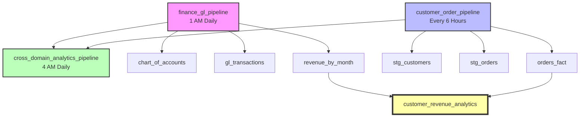

# DAG to Data Capsule Mapping

## Overview

This document maps Airflow DAGs to the Data Capsule Server (DCS) capsules they process, demonstrating how orchestration workflows align with the data catalog.

---

## Finance Domain

### DAG: `finance_gl_pipeline`

**Schedule:** Daily at 1 AM (after ERP batch loads)
**Domain:** Finance
**Data Product:** Financial Reporting Product (v1.0.0), General Ledger Data Product (v1.0.0)

| Task ID | Capsule URN | Capsule Name | Layer | Type | Purpose |
|---------|-------------|--------------|-------|------|---------|
| `validate_chart_of_accounts` | `urn:dcs:postgres:table:finance_erp.master:chart_of_accounts` | chart_of_accounts | Gold | Master Data | Validate account hierarchy and uniqueness |
| `load_gl_transactions` | `urn:dcs:postgres:table:finance_erp.facts:gl_transactions` | gl_transactions | Gold | Fact Table | Load and validate transactions from ERP |
| `check_double_entry_balance` | `urn:dcs:postgres:table:finance_erp.facts:gl_transactions` | gl_transactions | Gold | Fact Table | SOX Control: Verify debits = credits |
| `generate_revenue_by_month` | `urn:dcs:dbt:model:finance_analytics.marts:revenue_by_month` | revenue_by_month | Gold | Mart | Generate monthly revenue aggregates |

**Lineage Flow:**
```
chart_of_accounts → gl_transactions → revenue_by_month
```

**Compliance:**
- SOX Controls: ITGC-01, FSCA-02, FSCA-03
- GAAP Compliance
- 7-year retention policy
- Audit trail required

---

## Customer Domain

### DAG: `customer_order_pipeline`

**Schedule:** Every 6 hours
**Domain:** Customer / Jaffle Shop
**Data Product:** Orders Data Product

| Task ID | Capsule URN | Capsule Name | Layer | Type | Purpose |
|---------|-------------|--------------|-------|------|---------|
| `stage_customers` | `urn:dcs:dbt:model:jaffle_shop.staging:stg_customers` | stg_customers | Silver | Dimension | Stage and clean customer dimension |
| `profile_customer_data` | `urn:dcs:dbt:model:jaffle_shop.staging:stg_customers` | stg_customers | Silver | Dimension | Profile data quality metrics |
| `stage_orders` | `urn:dcs:dbt:model:jaffle_shop.staging:stg_orders` | stg_orders | Silver | Fact | Stage order transactions |
| `validate_order_referential_integrity` | `urn:dcs:dbt:model:jaffle_shop.staging:stg_orders` | stg_orders | Silver | Fact | Validate FK to customers |
| `build_orders_fact` | `urn:dcs:dbt:model:jaffle_shop.marts:orders_fact` | orders_fact | Gold | Mart | Build enriched order fact table |
| `test_orders_fact` | `urn:dcs:dbt:model:jaffle_shop.marts:orders_fact` | orders_fact | Gold | Mart | Run dbt quality tests |

**Lineage Flow:**
```
stg_customers ──┐
                ├─→ orders_fact
stg_orders ─────┘
```

**Quality Rules:**
- Customer ID uniqueness
- Order-customer referential integrity
- Order status enumeration
- Non-null constraints

---

## Cross-Domain Analytics

### DAG: `cross_domain_analytics_pipeline`

**Schedule:** Daily at 4 AM (after source pipelines complete)
**Domain:** Analytics (Cross-domain)
**Data Product:** Customer Revenue Analytics

**Upstream Dependencies:**
- `finance_gl_pipeline` (Finance domain)
- `customer_order_pipeline` (Customer domain)

| Task ID | Source Capsule URN | Capsule Name | Output Capsule | Purpose |
|---------|-------------------|--------------|----------------|---------|
| `wait_for_finance_pipeline` | - | - | - | External task sensor |
| `wait_for_customer_pipeline` | - | - | - | External task sensor |
| `extract_revenue_data` | `urn:dcs:dbt:model:finance_analytics.marts:revenue_by_month` | revenue_by_month | - | Extract finance domain data |
| `extract_customer_order_data` | `urn:dcs:dbt:model:jaffle_shop.marts:orders_fact` | orders_fact | - | Extract customer domain data |
| `join_cross_domain_data` | Both above | - | `customer_revenue_analytics` | Join and reconcile cross-domain |
| `materialize_analytics_mart` | - | - | `customer_revenue_analytics` | Create integrated mart |

**Output Capsule (Conceptual):**
- **URN:** `urn:dcs:dbt:model:analytics.marts:customer_revenue_analytics`
- **Type:** Cross-domain analytical mart
- **Purpose:** Integrated customer revenue analytics

**Lineage Flow (Cross-Domain):**
```
Finance Domain                     Customer Domain
     ↓                                    ↓
revenue_by_month ──┐              orders_fact
                   ├────→ customer_revenue_analytics
                   └────→ (Cross-Domain Mart)
```

**Quality Validation:**
- Revenue reconciliation (±5% variance threshold)
- No orphaned records
- Date range alignment

**Consumers:**
- executive_dashboard
- finance_reporting
- customer_analytics

---

## DAG Dependencies Graph



---

## Data Capsule Dimensions Coverage

Each DAG demonstrates all 7 dimensions of the Data Capsule model:

### 1. Identity & Context
- URN identification
- Capsule type (master, fact, dimension, mart)
- Data layer (bronze, silver, gold)
- Domain assignment (finance, customer)

### 2. Structural Metadata
- Column definitions in task documentation
- Constraint validation (PK, FK, CHECK)
- Index usage noted

### 3. Business Terms
- Revenue, debit, credit (Finance)
- Customer_id, order_status (Customer)
- Fiscal_period

### 4. Quality & Profiling
- Data quality checks at each stage
- Profiling tasks (e.g., `profile_customer_data`)
- Custom quality rules (double-entry balance)

### 5. Data Policies
- Compliance tags: SOX, GAAP, regulatory
- Sensitivity levels: internal, restricted, confidential
- Retention policies: 7-year, 10-year
- PII masking rules

### 6. Lineage & Transformation
- Upstream/downstream dependencies
- Transformation logic documented
- Version tracking
- SQL/dbt transformation details

### 7. Operational Contract
- SLA validation tasks
- Freshness requirements (1hr, 6hr, 24hr)
- Availability targets (99.9%, 99.99%)
- Support tier (critical 24/7, business hours)
- Known consumers listed

---

## Airflow Parser Integration

When the DCS Airflow parser ingests these DAGs, it will create:

### DAG Capsules
Each DAG becomes an `airflow_dag` capsule:
- **URN:** `urn:dcs:airflow:dag:local-dev:finance_gl_pipeline`
- **Type:** `airflow_dag`
- **Metadata:** Schedule, owners, tags, description

### Task Capsules
Each task becomes an `airflow_task` capsule:
- **URN:** `urn:dcs:airflow:task:local-dev:finance_gl_pipeline.validate_chart_of_accounts`
- **Type:** `airflow_task`
- **Metadata:** Operator type, retries, timeouts

### Edges
Two edge types are created:
1. **CONTAINS:** DAG → Task
   - `finance_gl_pipeline` CONTAINS `validate_chart_of_accounts`
2. **FLOWS_TO:** Task → Task dependencies
   - `validate_chart_of_accounts` FLOWS_TO `load_gl_transactions`

### Complete Lineage Example

After ingestion, the finance pipeline lineage in DCS would show:

```
Orchestration Layer (Airflow):
  finance_gl_pipeline (DAG)
    → validate_chart_of_accounts (Task)
    → load_gl_transactions (Task)
    → check_double_entry_balance (Task)
    → generate_revenue_by_month (Task)

Data Layer (Capsules):
  chart_of_accounts (Capsule)
    → gl_transactions (Capsule)
    → revenue_by_month (Capsule)

Combined View:
  Airflow orchestrates → Data capsule processing
```

---

## Testing the Integration

### 1. View DAGs in Airflow UI
```
http://localhost:8080
Login: admin / admin
```

### 2. Trigger Manual DAG Run
```bash
docker exec dab-airflow airflow dags trigger finance_gl_pipeline
```

### 3. Check Task Logs
```bash
docker exec dab-airflow airflow tasks logs finance_gl_pipeline validate_chart_of_accounts <run_id>
```

### 4. Ingest into DCS (via Airflow Parser)
```bash
# Set up authentication
export AIRFLOW_TOKEN=$(docker exec dab-airflow airflow users create \
  --username dcs_parser --password dcs_parser --role Admin \
  --firstname DCS --lastname Parser --email dcs@example.com 2>&1 | grep token || echo "")

# Run ingestion
cd backend
python -m src.cli.main ingest airflow \
  --base-url http://localhost:8080 \
  --instance local-dev \
  --include-paused
```

### 5. Query Ingested Metadata in DCS
```bash
# List Airflow DAG capsules
curl http://localhost:8000/api/v1/capsules?capsule_type=airflow_dag

# Get specific DAG
curl http://localhost:8000/api/v1/capsules?name=finance_gl_pipeline

# Export lineage graph (Mermaid)
curl http://localhost:8000/api/v1/graph/export/lineage/urn:dcs:airflow:dag:local-dev:finance_gl_pipeline?format=mermaid
```

---

## Summary Statistics

| Metric | Count |
|--------|-------|
| Total DAGs | 5 |
| New DAGs (DCS-based) | 3 |
| Legacy DAGs | 2 |
| Total Data Capsules Referenced | 6 |
| Finance Domain Capsules | 3 |
| Customer Domain Capsules | 3 |
| Cross-Domain Marts | 1 |
| Data Products | 3 |
| Compliance Frameworks | 3 (SOX, GAAP, IFRS) |
| Quality Rules Demonstrated | 12+ |

---

**Last Updated:** December 28, 2025
**Maintained By:** Data Platform Team
