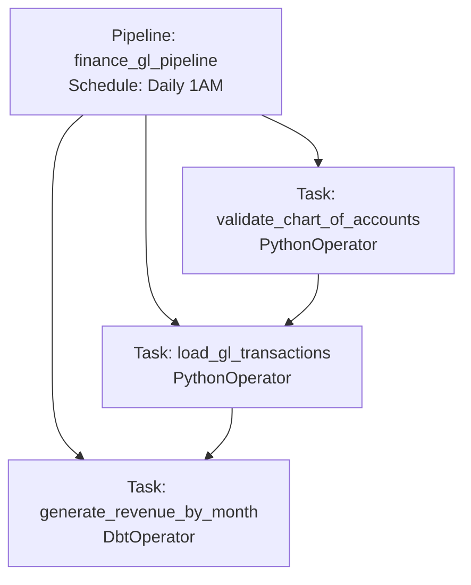
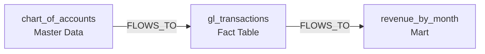
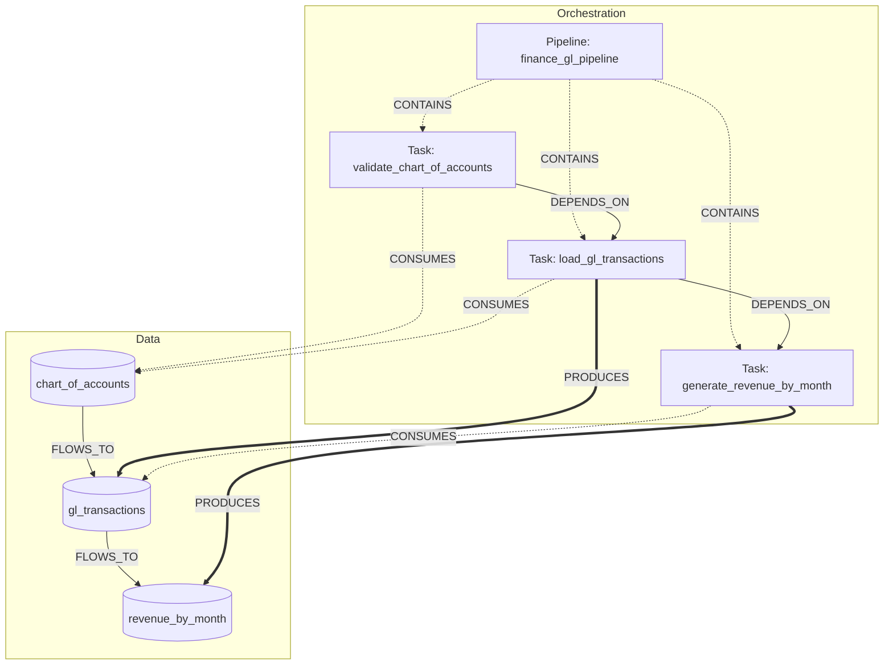

# Airflow Orchestration Metamodel Design

**Version**: 1.0
**Status**: Design (Not Implemented)
**Created**: December 28, 2025
**Author**: Data Architecture Team

---

## Table of Contents

1. [Problem Statement](#1-problem-statement)
2. [Design Principles](#2-design-principles)
3. [Metamodel Extension](#3-metamodel-extension)
4. [Entity Definitions](#4-entity-definitions)
5. [Relationship Model](#5-relationship-model)
6. [Data Flow Tracking](#6-data-flow-tracking)
7. [Ingestion Strategy](#7-ingestion-strategy)
8. [Query Patterns](#8-query-patterns)
9. [Visualization Design](#9-visualization-design)
10. [Implementation Phases](#10-implementation-phases)

---

## 1. Problem Statement

### 1.1 Current Issue

The current implementation treats Airflow DAGs and tasks as **Data Capsules**, which is conceptually incorrect:

```
❌ CURRENT (INCORRECT):
- cross_domain_analytics_pipeline → treated as a data capsule
- validate_chart_of_accounts → treated as a data capsule
- Total: 42 "capsules" created (but they're not data assets!)
```

### 1.2 Correct Model

Airflow metadata represents **orchestration/pipeline metadata**, not data assets:

```
✓ CORRECT MODEL:
- Airflow DAGs = Pipeline/Orchestration metadata
- Airflow Tasks = Processing steps within pipelines
- Data Capsules = Actual data assets (tables, views, models)
- Relationship = Pipelines PRODUCE/CONSUME/TRANSFORM data capsules
```

### 1.3 Key Insights from Product Spec

From [product_specification.md](../specs/product_specification.md):

> **Line 878**: "Airflow | P2 | DAG definitions | **Pipeline metadata**"

This confirms Airflow is about orchestration, not data assets.

---

## 2. Design Principles

### 2.1 Core Principles

1. **Separation of Concerns**: Clearly separate orchestration metadata from data metadata
2. **Dual Lineage**: Track both data lineage (capsule → capsule) and orchestration lineage (pipeline → capsule)
3. **Deep Integration**: Link orchestration to data transformations (e.g., Airflow task → dbt job → models → capsules)
4. **Unified View**: Present both perspectives in a coherent, queryable model

### 2.2 Design Goals

| Goal | Description |
|------|-------------|
| **Correct Categorization** | Airflow DAGs/tasks are NOT capsules |
| **Data Flow Tracking** | Track how data flows through pipelines |
| **Tool Integration** | Link Airflow → dbt → Snowflake transformations |
| **Impact Analysis** | Answer "if I change this pipeline, what data is affected?" |
| **Ownership Clarity** | Show which pipelines own which data assets |

---

## 3. Metamodel Extension

### 3.1 New Entity Hierarchy

```
DCS Metamodel (Extended)
├── Data Layer (existing)
│   ├── DataCapsule (tables, views, models, datasets)
│   ├── Column
│   ├── Domain
│   ├── DataProduct
│   └── SourceSystem
├── Orchestration Layer (NEW)
│   ├── Pipeline (DAG, Workflow, Job)
│   ├── PipelineTask (Task, Step, Stage)
│   ├── PipelineRun (Execution instance)
│   └── TaskRun (Task execution instance)
└── Relationships (NEW)
    ├── Data-to-Data (FLOWS_TO)
    ├── Orchestration-to-Data (PRODUCES, CONSUMES, TRANSFORMS)
    └── Orchestration-to-Orchestration (CONTAINS, DEPENDS_ON, TRIGGERS)
```

### 3.2 Layer Separation

```
┌─────────────────────────────────────────────────────────────┐
│                    ORCHESTRATION LAYER                      │
│  (How data is moved, when, by whom)                         │
├─────────────────────────────────────────────────────────────┤
│  Pipeline (DAG)                                             │
│  ├── finance_gl_pipeline                                    │
│  │   ├── PipelineTask: validate_chart_of_accounts          │
│  │   ├── PipelineTask: load_gl_transactions                │
│  │   └── PipelineTask: generate_revenue_by_month           │
│  └── customer_order_pipeline                                │
│      ├── PipelineTask: stage_customers                      │
│      └── PipelineTask: build_orders_fact                    │
└─────────────────────────────────────────────────────────────┘
                            │
                            │ PRODUCES / CONSUMES / TRANSFORMS
                            ↓
┌─────────────────────────────────────────────────────────────┐
│                       DATA LAYER                            │
│  (What data exists, its structure, lineage)                 │
├─────────────────────────────────────────────────────────────┤
│  DataCapsule                                                │
│  ├── chart_of_accounts (table)                             │
│  ├── gl_transactions (table)                                │
│  ├── revenue_by_month (mart)                                │
│  ├── stg_customers (model)                                  │
│  └── orders_fact (mart)                                     │
└─────────────────────────────────────────────────────────────┘
```

---

## 4. Entity Definitions

### 4.1 Pipeline (Orchestration Entity)

**Purpose**: Represents a DAG, workflow, or job that orchestrates data processing.

```python
class Pipeline:
    """
    Represents an orchestration workflow (Airflow DAG, dbt project run, etc.)
    NOT a data capsule - this is process/orchestration metadata.
    """
    # Identity
    urn: str  # e.g., urn:dcs:pipeline:airflow:local-dev:finance_gl_pipeline
    name: str
    pipeline_type: PipelineType  # airflow_dag, dbt_run, databricks_job, etc.

    # Source system
    source_system_id: UUID
    source_system_identifier: str  # e.g., DAG ID in Airflow

    # Orchestration metadata
    schedule_interval: Optional[str]
    owners: List[str]
    tags: List[str]
    description: Optional[str]

    # Status
    is_paused: bool
    is_active: bool

    # Configuration
    config: dict  # DAG-specific config (catchup, max_active_runs, etc.)

    # Temporal
    first_seen: datetime
    last_seen: datetime

    # Metadata
    meta: dict  # File location, version, etc.
```

**URN Schema**:
```
urn:dcs:pipeline:{tool}:{instance}:{pipeline_id}

Examples:
urn:dcs:pipeline:airflow:local-dev:finance_gl_pipeline
urn:dcs:pipeline:dbt:production:jaffle_shop
urn:dcs:pipeline:databricks:prod-cluster:customer_etl
```

### 4.2 PipelineTask (Orchestration Entity)

**Purpose**: Represents a task/step within a pipeline.

```python
class PipelineTask:
    """
    Represents a task within a pipeline (Airflow task, dbt model run, etc.)
    Links to DataCapsules via PRODUCES/CONSUMES relationships.
    """
    # Identity
    urn: str  # e.g., urn:dcs:task:airflow:local-dev:finance_gl_pipeline.load_gl_transactions
    name: str
    task_type: TaskType  # python, bash, dbt, sql, sensor, etc.

    # Parent pipeline
    pipeline_id: UUID
    pipeline_urn: str

    # Task metadata
    operator: str  # PythonOperator, BashOperator, DbtOperator, etc.
    retries: int
    retry_delay: Optional[timedelta]
    timeout: Optional[timedelta]

    # Data operations (NEW - critical for lineage!)
    operation_type: OperationType  # extract, transform, load, validate, etc.

    # Tool integration (NEW - deep integration!)
    tool_reference: Optional[ToolReference]  # Links to dbt model, SQL script, etc.

    # Documentation
    description: Optional[str]
    doc_md: Optional[str]

    # Metadata
    meta: dict
```

**URN Schema**:
```
urn:dcs:task:{tool}:{instance}:{pipeline_id}.{task_id}

Examples:
urn:dcs:task:airflow:local-dev:finance_gl_pipeline.load_gl_transactions
urn:dcs:task:airflow:local-dev:customer_order_pipeline.build_orders_fact
```

### 4.3 ToolReference (NEW)

**Purpose**: Links a pipeline task to the actual data transformation tool/code.

```python
class ToolReference:
    """
    Links a pipeline task to the actual transformation code/job.
    Enables deep integration: Airflow → dbt → data capsules.
    """
    tool: str  # dbt, sql, python, spark, etc.
    reference_type: str  # model, script, notebook, query
    reference_identifier: str  # dbt model name, file path, etc.

    # For dbt integration
    dbt_project: Optional[str]
    dbt_model_name: Optional[str]
    dbt_selector: Optional[str]  # e.g., "tag:finance"

    # For SQL integration
    sql_script_path: Optional[str]
    sql_hash: Optional[str]

    # For Python/Spark integration
    code_path: Optional[str]
    code_hash: Optional[str]

# Example
ToolReference(
    tool="dbt",
    reference_type="model",
    reference_identifier="revenue_by_month",
    dbt_project="finance_analytics",
    dbt_model_name="revenue_by_month"
)
```

### 4.4 PipelineRun & TaskRun (Execution Tracking)

**Purpose**: Track execution history and runtime data flow.

```python
class PipelineRun:
    """Execution instance of a pipeline."""
    run_id: str
    pipeline_id: UUID
    execution_date: datetime
    start_time: datetime
    end_time: Optional[datetime]
    status: RunStatus  # success, failed, running
    trigger: str  # scheduled, manual, sensor

class TaskRun:
    """Execution instance of a task."""
    task_run_id: str
    pipeline_run_id: str
    task_id: UUID
    start_time: datetime
    end_time: Optional[datetime]
    status: RunStatus

    # Runtime data lineage (NEW - crucial!)
    data_capsules_read: List[str]  # URNs of capsules read
    data_capsules_written: List[str]  # URNs of capsules written
    rows_read: Optional[int]
    rows_written: Optional[int]
```

---

## 5. Relationship Model

### 5.1 Orchestration-to-Orchestration Relationships

| Relationship | From | To | Description |
|--------------|------|-----|-------------|
| `CONTAINS` | Pipeline | PipelineTask | Pipeline contains tasks |
| `DEPENDS_ON` | PipelineTask | PipelineTask | Task dependency within DAG |
| `TRIGGERS` | Pipeline | Pipeline | Cross-DAG triggering (ExternalTaskSensor) |

**Graph Representation**:
```
Pipeline: finance_gl_pipeline
  │
  ├─[CONTAINS]→ Task: validate_chart_of_accounts
  │               │
  │               └─[DEPENDS_ON]→ Task: load_gl_transactions
  │                                 │
  │                                 └─[DEPENDS_ON]→ Task: generate_revenue_by_month
  │
  └─[TRIGGERS]→ Pipeline: cross_domain_analytics_pipeline
```

### 5.2 Orchestration-to-Data Relationships (CRITICAL)

| Relationship | From | To | Description | Properties |
|--------------|------|-----|-------------|------------|
| `PRODUCES` | PipelineTask | DataCapsule | Task creates/updates capsule | operation: insert/update/merge |
| `CONSUMES` | PipelineTask | DataCapsule | Task reads from capsule | access_pattern: full_scan/selective |
| `TRANSFORMS` | PipelineTask | DataCapsule | Task transforms capsule in-place | transformation_type |
| `VALIDATES` | PipelineTask | DataCapsule | Task validates capsule quality | validation_type |

**Graph Representation**:
```
Task: load_gl_transactions
  │
  ├─[CONSUMES]→ DataCapsule: chart_of_accounts
  │               (reads account hierarchy)
  │
  └─[PRODUCES]→ DataCapsule: gl_transactions
                  (inserts daily transactions)

Task: generate_revenue_by_month
  │
  ├─[CONSUMES]→ DataCapsule: gl_transactions
  │               (aggregates by fiscal_period)
  │
  └─[PRODUCES]→ DataCapsule: revenue_by_month
                  (incremental insert)
```

### 5.3 Data-to-Data Relationships (Existing)

| Relationship | From | To | Description |
|--------------|------|-----|-------------|
| `FLOWS_TO` | DataCapsule | DataCapsule | Data lineage |
| `DERIVED_FROM` | Column | Column | Column-level lineage |

**This remains unchanged** - it captures the logical data flow independent of orchestration.

### 5.4 Unified Lineage View

**Combining both perspectives**:

```
LOGICAL DATA LINEAGE (Data Layer):
chart_of_accounts ──→ gl_transactions ──→ revenue_by_month
                      (FLOWS_TO)          (FLOWS_TO)

ORCHESTRATION LINEAGE (Orchestration Layer):
Pipeline: finance_gl_pipeline
  Task: validate_chart_of_accounts ──[CONSUMES]──→ chart_of_accounts
  Task: load_gl_transactions ──[CONSUMES]──→ chart_of_accounts
                             ──[PRODUCES]──→ gl_transactions
  Task: generate_revenue_by_month ──[CONSUMES]──→ gl_transactions
                                  ──[PRODUCES]──→ revenue_by_month

INTEGRATED VIEW:
chart_of_accounts
  ↓ [FLOWS_TO (logical)]
  ↓ [PRODUCED_BY: finance_gl_pipeline.load_gl_transactions]
gl_transactions
  ↓ [FLOWS_TO (logical)]
  ↓ [PRODUCED_BY: finance_gl_pipeline.generate_revenue_by_month]
revenue_by_month
```

---

## 6. Data Flow Tracking

### 6.1 Static Data Flow (Design Time)

**Source**: Airflow DAG definitions + Task configurations

**Captured via**:
1. **Task-to-Capsule mapping** (manual or inferred):
   ```python
   # In DAG code or metadata
   @task(
       produces=["urn:dcs:postgres:table:finance_erp.facts:gl_transactions"],
       consumes=["urn:dcs:postgres:table:finance_erp.master:chart_of_accounts"]
   )
   def load_gl_transactions():
       ...
   ```

2. **dbt Task integration** (automatic):
   ```python
   # Airflow task that runs dbt
   dbt_run_task = DbtOperator(
       task_id='dbt_run_silver',
       models='tag:silver'
   )
   # System automatically links to dbt models with tag:silver
   # and their produced capsules
   ```

3. **SQL parsing** (automatic):
   ```python
   # For BashOperator with SQL
   run_sql = BashOperator(
       task_id='load_customers',
       bash_command='psql -f load_customers.sql'
   )
   # System parses load_customers.sql to extract:
   # - Tables read (CONSUMES)
   # - Tables written (PRODUCES)
   ```

### 6.2 Runtime Data Flow (Execution Time)

**Source**: Airflow task logs + OpenLineage events + dbt artifacts

**Captured via**:
1. **OpenLineage integration** (if available):
   - Airflow sends LineageEvents
   - DCS consumes and links to capsules

2. **dbt artifact correlation**:
   - When dbt task runs, capture `run_results.json`
   - Link executed models to capsules
   - Track actual rows processed

3. **Log parsing** (fallback):
   - Parse task logs for data references
   - Extract table names, row counts

### 6.3 Deep dbt Integration Example

**Scenario**: Airflow task runs `dbt run --select tag:finance`

```
Airflow Task: run_dbt_finance
  ├─[EXECUTES]→ dbt command: "dbt run --select tag:finance"
  │
  ├─[TRIGGERS]→ dbt models (discovered from manifest.json):
  │   ├── chart_of_accounts (skipped, already exists)
  │   ├── gl_transactions (executed)
  │   └── revenue_by_month (executed)
  │
  └─[PRODUCES]→ DataCapsules (linked via dbt URNs):
      ├── urn:dcs:postgres:table:finance_erp.facts:gl_transactions
      └── urn:dcs:dbt:model:finance_analytics.marts:revenue_by_month
```

**Data captured**:
```python
TaskRun(
    task_id="run_dbt_finance",
    tool_reference=ToolReference(
        tool="dbt",
        dbt_selector="tag:finance",
        dbt_models_executed=["gl_transactions", "revenue_by_month"]
    ),
    data_capsules_written=[
        "urn:dcs:postgres:table:finance_erp.facts:gl_transactions",
        "urn:dcs:dbt:model:finance_analytics.marts:revenue_by_month"
    ],
    rows_written=125000
)
```

---

## 7. Ingestion Strategy

### 7.1 Two-Phase Ingestion

#### Phase 1: Orchestration Metadata Ingestion

**Input**: Airflow REST API (`/api/v1/dags`, `/api/v1/dags/{dag_id}/tasks`)

**Process**:
1. Create `Pipeline` entities for each DAG
2. Create `PipelineTask` entities for each task
3. Create `CONTAINS` edges (DAG → Task)
4. Create `DEPENDS_ON` edges (Task → Task dependencies)
5. Create `TRIGGERS` edges (ExternalTaskSensor)

**Output**: Orchestration graph

#### Phase 2: Data Flow Mapping

**Input**:
- Task configurations (operators, commands)
- dbt manifest.json (if DbtOperator used)
- SQL scripts (if referenced)
- OpenLineage events (if available)

**Process**:
1. For each PipelineTask:
   - Identify task type/operator
   - Extract data references (table names, dbt models, etc.)
   - Match to existing DataCapsules by URN
   - Create `PRODUCES`/`CONSUMES`/`TRANSFORMS` edges

2. For dbt tasks specifically:
   - Parse dbt selector (e.g., `tag:finance`)
   - Query dbt manifest for matching models
   - Link each model to its DataCapsule
   - Create edges for all capsules produced

3. For SQL tasks:
   - Parse SQL (INSERT/UPDATE/SELECT)
   - Extract table references
   - Create appropriate edges

**Output**: Integrated orchestration + data graph

### 7.2 Ingestion Flow Diagram

```
┌─────────────────────┐
│  Airflow REST API   │
│  /api/v1/dags       │
└──────────┬──────────┘
           │
           ↓
┌─────────────────────────────────────────┐
│  Phase 1: Orchestration Ingestion       │
├─────────────────────────────────────────┤
│  - Create Pipeline entities             │
│  - Create PipelineTask entities         │
│  - Create orchestration edges           │
└──────────┬──────────────────────────────┘
           │
           ↓
┌─────────────────────────────────────────┐
│  Phase 2: Data Flow Mapping             │
├─────────────────────────────────────────┤
│  ┌─────────────────────────────────┐   │
│  │ For each PipelineTask:          │   │
│  │                                  │   │
│  │ IF DbtOperator:                 │   │
│  │   → Parse dbt selector          │   │
│  │   → Query dbt manifest          │   │
│  │   → Link to DataCapsules        │   │
│  │                                  │   │
│  │ IF SqlOperator:                 │   │
│  │   → Parse SQL                   │   │
│  │   → Extract table refs          │   │
│  │   → Link to DataCapsules        │   │
│  │                                  │   │
│  │ IF BashOperator:                │   │
│  │   → Analyze command             │   │
│  │   → Extract references          │   │
│  │   → Link to DataCapsules        │   │
│  └─────────────────────────────────┘   │
└──────────┬──────────────────────────────┘
           │
           ↓
┌─────────────────────────────────────────┐
│  DCS Graph (Integrated)                 │
├─────────────────────────────────────────┤
│  - Pipeline + PipelineTask entities     │
│  - DataCapsule entities                 │
│  - Orchestration edges                  │
│  - Data flow edges (PRODUCES/CONSUMES)  │
│  - Logical lineage edges (FLOWS_TO)     │
└─────────────────────────────────────────┘
```

### 7.3 Ingestion Configuration

```yaml
# airflow_ingestion_config.yaml
ingestion:
  phases:
    - name: orchestration
      enabled: true
      captures:
        - dags
        - tasks
        - dependencies
        - schedules

    - name: data_flow
      enabled: true
      strategies:
        dbt_integration:
          enabled: true
          manifest_path: /path/to/manifest.json
          auto_link_models: true

        sql_parsing:
          enabled: true
          parsers: [postgres, snowflake, bigquery]
          confidence_threshold: 0.8

        openlineage:
          enabled: false
          endpoint: http://localhost:5000/api/v1/lineage

        manual_annotations:
          enabled: true
          annotations_file: ./airflow_annotations.yaml

# airflow_annotations.yaml (manual data flow mapping)
tasks:
  - dag_id: finance_gl_pipeline
    task_id: load_gl_transactions
    produces:
      - urn:dcs:postgres:table:finance_erp.facts:gl_transactions
    consumes:
      - urn:dcs:postgres:table:finance_erp.master:chart_of_accounts
    operation_type: insert

  - dag_id: finance_gl_pipeline
    task_id: generate_revenue_by_month
    produces:
      - urn:dcs:dbt:model:finance_analytics.marts:revenue_by_month
    consumes:
      - urn:dcs:postgres:table:finance_erp.facts:gl_transactions
    operation_type: incremental
    tool_reference:
      tool: dbt
      dbt_model_name: revenue_by_month
```

---

## 8. Query Patterns

### 8.1 Query: "Which pipelines produce this data capsule?"

```sql
-- API: GET /api/v1/capsules/{urn}/producers

SELECT p.name as pipeline_name,
       pt.name as task_name,
       pt.operator,
       e.properties->>'operation' as operation_type
FROM pipeline_tasks pt
JOIN pipelines p ON pt.pipeline_id = p.id
JOIN edges e ON e.source_id = pt.id
JOIN capsules c ON e.target_id = c.id
WHERE c.urn = 'urn:dcs:postgres:table:finance_erp.facts:gl_transactions'
  AND e.edge_type = 'PRODUCES'
```

**Result**:
```json
{
  "capsule_urn": "urn:dcs:postgres:table:finance_erp.facts:gl_transactions",
  "producers": [
    {
      "pipeline": "finance_gl_pipeline",
      "task": "load_gl_transactions",
      "operator": "PythonOperator",
      "operation": "insert",
      "schedule": "0 1 * * *"
    }
  ]
}
```

### 8.2 Query: "What data does this pipeline touch?"

```sql
-- API: GET /api/v1/pipelines/{urn}/data-footprint

SELECT c.urn,
       c.name,
       c.layer,
       e.edge_type as interaction_type,
       COUNT(DISTINCT pt.id) as task_count
FROM pipelines p
JOIN pipeline_tasks pt ON pt.pipeline_id = p.id
JOIN edges e ON e.source_id = pt.id
JOIN capsules c ON e.target_id = c.id
WHERE p.urn = 'urn:dcs:pipeline:airflow:local-dev:finance_gl_pipeline'
  AND e.edge_type IN ('PRODUCES', 'CONSUMES', 'TRANSFORMS')
GROUP BY c.urn, c.name, c.layer, e.edge_type
```

**Result**:
```json
{
  "pipeline_urn": "urn:dcs:pipeline:airflow:local-dev:finance_gl_pipeline",
  "data_footprint": {
    "consumes": [
      {
        "capsule": "chart_of_accounts",
        "layer": "gold",
        "task_count": 2
      }
    ],
    "produces": [
      {
        "capsule": "gl_transactions",
        "layer": "gold",
        "task_count": 1
      },
      {
        "capsule": "revenue_by_month",
        "layer": "gold",
        "task_count": 1
      }
    ]
  }
}
```

### 8.3 Query: "Trace data flow through pipeline and data layers"

```sql
-- API: GET /api/v1/lineage/end-to-end?start_capsule={urn}

-- Returns combined orchestration + data lineage
WITH RECURSIVE lineage AS (
  -- Base: Starting capsule
  SELECT c.id, c.urn, c.name, 0 as depth,
         ARRAY[c.id] as path, 'capsule' as node_type
  FROM capsules c
  WHERE c.urn = 'urn:dcs:postgres:table:finance_erp.master:chart_of_accounts'

  UNION ALL

  -- Data lineage (FLOWS_TO)
  SELECT c2.id, c2.urn, c2.name, l.depth + 1,
         l.path || c2.id, 'capsule' as node_type
  FROM lineage l
  JOIN edges e ON e.source_id = l.id AND e.edge_type = 'FLOWS_TO'
  JOIN capsules c2 ON e.target_id = c2.id
  WHERE NOT c2.id = ANY(l.path) AND l.depth < 10

  UNION ALL

  -- Orchestration layer (which tasks produce downstream capsules)
  SELECT pt.id, pt.urn, pt.name, l.depth,
         l.path, 'task' as node_type
  FROM lineage l
  JOIN edges e ON e.target_id = l.id AND e.edge_type = 'PRODUCES'
  JOIN pipeline_tasks pt ON e.source_id = pt.id
  WHERE l.node_type = 'capsule'
)
SELECT * FROM lineage ORDER BY depth
```

### 8.4 Query: "Impact analysis - if I pause this pipeline, what breaks?"

```sql
-- API: GET /api/v1/pipelines/{urn}/impact-analysis

-- Find all downstream capsules that depend on this pipeline's outputs
WITH pipeline_outputs AS (
  SELECT DISTINCT c.id as capsule_id, c.urn, c.name
  FROM pipelines p
  JOIN pipeline_tasks pt ON pt.pipeline_id = p.id
  JOIN edges e ON e.source_id = pt.id AND e.edge_type = 'PRODUCES'
  JOIN capsules c ON e.target_id = c.id
  WHERE p.urn = 'urn:dcs:pipeline:airflow:local-dev:finance_gl_pipeline'
),
downstream_capsules AS (
  SELECT c2.urn, c2.name, c2.layer
  FROM pipeline_outputs po
  JOIN edges e ON e.source_id = po.capsule_id AND e.edge_type = 'FLOWS_TO'
  JOIN capsules c2 ON e.target_id = c2.id
),
affected_pipelines AS (
  SELECT DISTINCT p2.urn, p2.name, p2.schedule_interval
  FROM downstream_capsules dc
  JOIN edges e ON e.target_id = (SELECT id FROM capsules WHERE urn = dc.urn)
             AND e.edge_type = 'CONSUMES'
  JOIN pipeline_tasks pt ON e.source_id = pt.id
  JOIN pipelines p2 ON pt.pipeline_id = p2.id
)
SELECT * FROM affected_pipelines
```

---

## 9. Visualization Design

### 9.1 Separate Views

#### View 1: Orchestration View (Pipeline-Centric)

**Purpose**: Show pipeline structure and task dependencies

```
┌─────────────────────────────────────────────────────────┐
│  Pipeline: finance_gl_pipeline                          │
│  Schedule: Daily at 1 AM                                │
├─────────────────────────────────────────────────────────┤
│                                                         │
│  ┌──────────────────────┐                              │
│  │ validate_chart_of_   │                              │
│  │ accounts             │                              │
│  │ [PythonOperator]     │                              │
│  └──────┬───────────────┘                              │
│         │                                               │
│         ↓                                               │
│  ┌──────────────────────┐                              │
│  │ load_gl_             │                              │
│  │ transactions         │                              │
│  │ [PythonOperator]     │                              │
│  └──────┬───────────────┘                              │
│         │                                               │
│         ↓                                               │
│  ┌──────────────────────┐                              │
│  │ generate_revenue_    │                              │
│  │ by_month             │                              │
│  │ [DbtOperator]        │───→ Executes dbt model      │
│  └──────────────────────┘                              │
│                                                         │
└─────────────────────────────────────────────────────────┘
```

#### View 2: Data Lineage View (Capsule-Centric)

**Purpose**: Show data flow between capsules

```
┌────────────────┐
│ chart_of_      │
│ accounts       │
│ [Master Data]  │
└───────┬────────┘
        │ FLOWS_TO
        ↓
┌────────────────┐
│ gl_            │
│ transactions   │
│ [Fact Table]   │
└───────┬────────┘
        │ FLOWS_TO
        ↓
┌────────────────┐
│ revenue_by_    │
│ month          │
│ [Mart]         │
└────────────────┘
```

#### View 3: Integrated View (RECOMMENDED)

**Purpose**: Show both orchestration and data flow

```
                    ORCHESTRATION                         DATA
┌──────────────────────────────────────────┐   ┌──────────────────┐
│  Pipeline: finance_gl_pipeline           │   │                  │
├──────────────────────────────────────────┤   │  ┌────────────┐  │
│                                          │   │  │chart_of_   │  │
│  Task: validate_chart_of_accounts        │───┼──│accounts    │  │
│  [CONSUMES]                              │   │  └──────┬─────┘  │
│                                          │   │         │        │
│         ↓ DEPENDS_ON                     │   │         │FLOWS_TO│
│                                          │   │         ↓        │
│  Task: load_gl_transactions              │───┼──│gl_         │  │
│  [CONSUMES] chart_of_accounts            │   │  │transactions│  │
│  [PRODUCES] gl_transactions              │───┼─→└──────┬─────┘  │
│                                          │   │         │        │
│         ↓ DEPENDS_ON                     │   │         │FLOWS_TO│
│                                          │   │         ↓        │
│  Task: generate_revenue_by_month         │   │  ┌────────────┐  │
│  [CONSUMES] gl_transactions              │───┼──│revenue_by_ │  │
│  [PRODUCES] revenue_by_month             │───┼─→│month       │  │
│  [DbtOperator: revenue_by_month model]   │   │  └────────────┘  │
│                                          │   │                  │
└──────────────────────────────────────────┘   └──────────────────┘
         Pipeline Structure                      Data Flow
```

### 9.2 Node Styling

**Visual Distinction**:

| Entity Type | Shape | Color | Icon |
|-------------|-------|-------|------|
| Pipeline | Rounded rectangle | Blue | 🔄 |
| PipelineTask | Rectangle | Light blue | ⚙️ |
| DataCapsule | Cylinder | Green | 📦 |
| Domain | Hexagon | Purple | 🏢 |

**Edge Styling**:

| Edge Type | Style | Color | Label |
|-----------|-------|-------|-------|
| DEPENDS_ON | Solid arrow | Gray | (none) |
| CONTAINS | Dashed line | Gray | (none) |
| PRODUCES | Bold arrow | Green | "produces" |
| CONSUMES | Thin arrow | Orange | "reads" |
| FLOWS_TO | Solid arrow | Black | (none) |

### 9.3 Interactive Features

1. **Toggle between views**: Orchestration / Data / Integrated
2. **Expand/collapse pipelines**: Show/hide task details
3. **Highlight data flow**: Click capsule → highlight all producers/consumers
4. **Filter by time**: Show pipelines active in specific time range
5. **Execution overlay**: Show last run status, duration, row counts

### 9.4 Mermaid Graph Export Examples

#### Orchestration-Only


#### Data-Only


#### Integrated


---

## 10. Implementation Phases

### Phase 1: Metamodel Extension (Week 1-2)

**Tasks**:
- [ ] Create `Pipeline`, `PipelineTask`, `ToolReference` models
- [ ] Create `PipelineRun`, `TaskRun` models
- [ ] Add new edge types: `PRODUCES`, `CONSUMES`, `TRANSFORMS`, `VALIDATES`
- [ ] Update database schema
- [ ] Create migrations

**Deliverables**:
- New database tables
- Updated ORM models
- Migration scripts

### Phase 2: Airflow Parser Update (Week 2-3)

**Tasks**:
- [ ] Refactor Airflow parser to create `Pipeline` entities (not Capsules)
- [ ] Implement Phase 1 ingestion (orchestration metadata)
- [ ] Implement `CONTAINS` and `DEPENDS_ON` edge creation
- [ ] Add support for `TRIGGERS` (ExternalTaskSensor)

**Deliverables**:
- Updated `AirflowParser` class
- Pipeline and task creation logic
- Tests for orchestration ingestion

### Phase 3: Data Flow Mapping (Week 3-5)

**Tasks**:
- [ ] Implement Phase 2 ingestion (data flow mapping)
- [ ] Add dbt integration (link DbtOperator to dbt models → capsules)
- [ ] Add SQL parsing for SqlOperator
- [ ] Implement manual annotations support
- [ ] Create `PRODUCES`/`CONSUMES` edges

**Deliverables**:
- Data flow mapping logic
- dbt manifest integration
- SQL parser integration
- Annotation file support

### Phase 4: API & Query Layer (Week 5-6)

**Tasks**:
- [ ] Add pipeline query endpoints
  - `GET /api/v1/pipelines`
  - `GET /api/v1/pipelines/{urn}`
  - `GET /api/v1/pipelines/{urn}/tasks`
  - `GET /api/v1/pipelines/{urn}/data-footprint`
- [ ] Add capsule-to-pipeline queries
  - `GET /api/v1/capsules/{urn}/producers`
  - `GET /api/v1/capsules/{urn}/consumers`
- [ ] Update lineage endpoints to include orchestration
  - `GET /api/v1/lineage/integrated?urn={urn}`
- [ ] Add impact analysis endpoint
  - `GET /api/v1/pipelines/{urn}/impact-analysis`

**Deliverables**:
- Pipeline API endpoints
- Updated lineage API
- Impact analysis queries

### Phase 5: CLI Updates (Week 6-7)

**Tasks**:
- [ ] Add pipeline commands
  ```bash
  dcs pipelines list
  dcs pipelines show <urn>
  dcs pipelines data-footprint <urn>
  ```
- [ ] Update ingestion command output
  - Report pipelines/tasks created (not "capsules")
- [ ] Add lineage commands for integrated view
  ```bash
  dcs lineage integrated <urn>
  ```

**Deliverables**:
- Updated CLI commands
- Correct reporting of ingestion statistics

### Phase 6: Visualization & Export (Week 7-8)

**Tasks**:
- [ ] Update graph export to support orchestration entities
- [ ] Implement Mermaid export for integrated view
- [ ] Add DOT export for Graphviz
- [ ] Create visualization templates
  - Orchestration-only view
  - Data-only view
  - Integrated view

**Deliverables**:
- Updated graph export logic
- Multiple export formats
- Visualization documentation

### Phase 7: Advanced Features (Week 9-10)

**Tasks**:
- [ ] Runtime lineage tracking (PipelineRun, TaskRun)
- [ ] OpenLineage integration (if available)
- [ ] Execution metrics (rows processed, duration)
- [ ] Time-based analysis (pipeline performance over time)

**Deliverables**:
- Execution tracking
- Runtime data flow capture
- Performance analytics

---

## 11. Example Scenarios

### Scenario 1: Finance GL Pipeline

**After Correct Ingestion**:

```
Created Orchestration Entities:
  ✓ 1 Pipeline: finance_gl_pipeline
  ✓ 6 PipelineTasks:
      - validate_chart_of_accounts
      - load_gl_transactions
      - check_double_entry_balance
      - generate_revenue_by_month
      - validate_revenue_sla
      - notify_finance_team

Created Orchestration Edges:
  ✓ 6 CONTAINS (pipeline → task)
  ✓ 5 DEPENDS_ON (task → task)

Linked to Data Capsules:
  ✓ CONSUMES: chart_of_accounts (2 tasks)
  ✓ PRODUCES: gl_transactions (1 task)
  ✓ CONSUMES: gl_transactions (2 tasks)
  ✓ PRODUCES: revenue_by_month (1 task)

Total:
  - Pipelines: 1
  - Tasks: 6
  - Data Capsules Linked: 3
  - Orchestration Edges: 11
  - Data Flow Edges: 6
```

### Scenario 2: Cross-Domain Analytics

**Query**: "Show me end-to-end flow from finance source to cross-domain analytics"

**Result**:
```
SOURCE: chart_of_accounts (Master Data)
  ↓ [FLOWS_TO]
  ↓ [PRODUCED_BY: finance_gl_pipeline.load_gl_transactions]
INTERMEDIATE: gl_transactions (Fact Table)
  ↓ [FLOWS_TO]
  ↓ [PRODUCED_BY: finance_gl_pipeline.generate_revenue_by_month]
INTERMEDIATE: revenue_by_month (Mart)
  ↓ [FLOWS_TO]
  ↓ [CONSUMED_BY: cross_domain_analytics_pipeline.extract_revenue_data]
  ↓ [PRODUCED_BY: cross_domain_analytics_pipeline.materialize_analytics_mart]
TARGET: customer_revenue_analytics (Cross-Domain Mart)

Pipeline Dependencies:
  finance_gl_pipeline (runs 1 AM)
    → cross_domain_analytics_pipeline (runs 4 AM, waits via ExternalTaskSensor)
```

### Scenario 3: dbt Integration

**Airflow Task**:
```python
dbt_run_finance = DbtOperator(
    task_id='dbt_run_finance',
    models='tag:finance',
    dbt_project_dir='/opt/airflow/dbt_project'
)
```

**Ingestion Result**:
```
PipelineTask: dbt_run_finance
  ├── tool_reference:
  │   - tool: dbt
  │   - dbt_selector: "tag:finance"
  │   - dbt_models: [chart_of_accounts, gl_transactions, revenue_by_month]
  │
  ├── PRODUCES:
  │   ├─→ DataCapsule: chart_of_accounts (via dbt model)
  │   ├─→ DataCapsule: gl_transactions (via dbt model)
  │   └─→ DataCapsule: revenue_by_month (via dbt model)
  │
  └── CONSUMES:
      └─→ DataCapsule: raw_transactions (upstream source)
```

---

## 12. Migration Strategy

### 12.1 Backward Compatibility

**Challenge**: Existing code treats Airflow DAGs as capsules.

**Solution**: Provide migration path

```python
# OLD (INCORRECT)
GET /api/v1/capsules?capsule_type=airflow_dag
# Returns: 5 "capsules" (WRONG)

# NEW (CORRECT)
GET /api/v1/pipelines?source=airflow
# Returns: 5 pipelines (CORRECT)

# Compatibility layer (temporary)
GET /api/v1/capsules?capsule_type=airflow_dag
# Returns: HTTP 301 Redirect to /api/v1/pipelines?source=airflow
# With deprecation warning header
```

### 12.2 Data Migration Script

```python
# migrate_airflow_capsules_to_pipelines.py

def migrate():
    # Find all capsules with capsule_type = 'airflow_dag' or 'airflow_task'
    airflow_capsules = Capsule.query.filter(
        Capsule.capsule_type.in_(['airflow_dag', 'airflow_task'])
    ).all()

    for capsule in airflow_capsules:
        if capsule.capsule_type == 'airflow_dag':
            # Convert to Pipeline
            pipeline = Pipeline(
                urn=capsule.urn.replace(':capsule:', ':pipeline:'),
                name=capsule.name,
                pipeline_type='airflow_dag',
                meta=capsule.meta,
                ...
            )
            db.session.add(pipeline)

        elif capsule.capsule_type == 'airflow_task':
            # Convert to PipelineTask
            task = PipelineTask(
                urn=capsule.urn.replace(':capsule:', ':task:'),
                name=capsule.name,
                task_type='airflow_task',
                meta=capsule.meta,
                ...
            )
            db.session.add(task)

        # Delete old capsule
        db.session.delete(capsule)

    db.session.commit()
```

---

## 13. Success Criteria

### 13.1 Functional Criteria

- [ ] Airflow DAGs create `Pipeline` entities (not `DataCapsule`)
- [ ] Airflow tasks create `PipelineTask` entities (not `DataCapsule`)
- [ ] Data flow edges (`PRODUCES`, `CONSUMES`) link tasks to capsules
- [ ] dbt tasks automatically link to dbt-generated capsules
- [ ] Integrated lineage view shows both orchestration and data flow
- [ ] Impact analysis works across pipeline and data layers

### 13.2 Quality Criteria

- [ ] Ingestion reports correct entity counts
  - "Created 5 pipelines, 42 tasks, linked to 15 data capsules"
  - NOT "Created 42 capsules"
- [ ] Queries distinguish between pipelines and capsules
- [ ] Visualization clearly separates orchestration from data
- [ ] API endpoints use correct terminology

### 13.3 Performance Criteria

- [ ] Ingestion time remains < 1s per DAG
- [ ] Integrated lineage query < 2s for depth 10
- [ ] Impact analysis < 3s for complex pipelines

---

## 14. Open Questions

1. **OpenLineage Integration**: Should we prioritize OpenLineage events over static parsing?
   - **Recommendation**: Start with static, add OpenLineage in Phase 7

2. **Multi-tool Pipelines**: How to handle pipelines that span multiple tools (Airflow → Databricks → dbt)?
   - **Recommendation**: Create separate Pipeline entities, link via `TRIGGERS` edges

3. **Column-level Lineage in Orchestration**: Should we track column-level lineage through pipelines?
   - **Recommendation**: Phase 2 feature - start with capsule-level

4. **Execution History Retention**: How long to keep PipelineRun/TaskRun records?
   - **Recommendation**: Configurable, default 90 days

5. **Real-time Updates**: Should pipeline status update in real-time?
   - **Recommendation**: Polling-based for MVP, webhooks for v2

---

## 15. References

- [Product Specification](../specs/product_specification.md) - Line 878: Airflow as pipeline metadata
- [Airflow Integration Design](./airflow_integration_design.md) - Original design (to be deprecated)
- [Database Schema](./database_schema.md) - Core schema (to be extended)
- [API Specification](./api_specification.md) - API patterns (to be extended)

---

**End of Design Document**

*This design correctly models Airflow as orchestration/pipeline metadata, separate from data capsules, enabling proper data flow tracking and integrated lineage views.*
