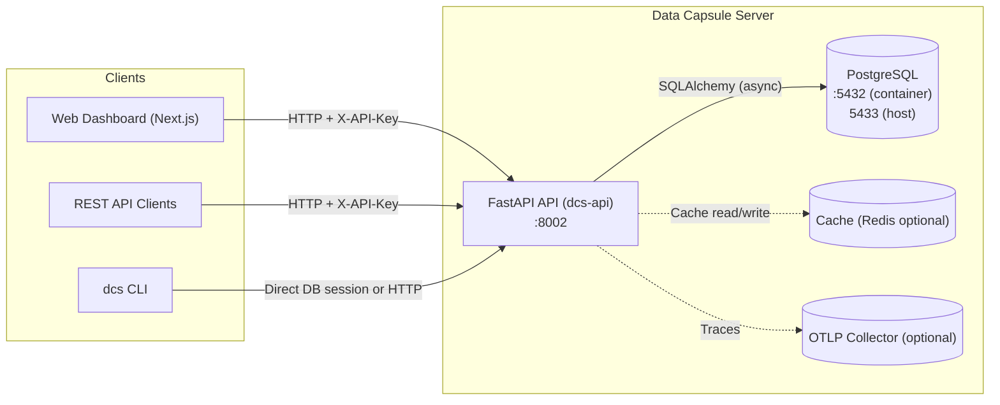
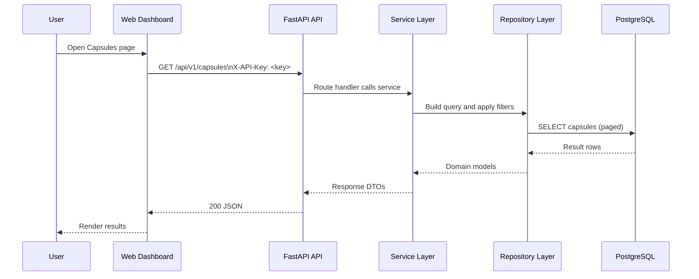

# Data Capsule Server — Manual (v1)

**Document type:** User + Administrator / Support Manual  
**Product:** Data Capsule Server (`data-capsule-server`)  
**Version:** 0.2.0 (API & CLI)  
**Date:** 17 Dec 2025  

---

## Table of Contents

1. Introduction
2. What the Platform Does (at a glance)
3. Core Concepts & Glossary
4. Architecture & Components
5. Services & Deployment Topology
6. Getting Started (local)
7. Web Dashboard — User Guide
8. CLI — User Guide
9. REST API — User Guide
10. Reports & Export
11. Configuration Reference
12. Operations & Support Runbook (condensed)
13. Troubleshooting
14. Support & Escalation

---

## 1. Introduction

Data Capsule Server is an architecture intelligence platform that **ingests metadata** (currently from dbt artifacts and Airflow) and builds a **unified, queryable property graph** of your data landscape. It helps teams monitor:

- **PII & sensitive data lineage** (inventory, exposure, and trace)
- **Architecture conformance** (rules, scoring, violations)
- **Lineage and impact analysis** (upstream/downstream dependencies)
- **Redundancy detection** (duplicate / overlapping assets)
- **Reporting and exports** (JSON, CSV, HTML; plus graph export formats)

> “Read-only” means *no mutations to source systems.* The platform stores metadata and relationships in its own PostgreSQL database and may allow updates to **internal metadata** (e.g., domains, tags, products, rule configuration).

### Intended audience

- Data Architects / Enterprise Architects
- Data Governance & Compliance
- Data Platform / Data Engineering
- Data Product Owners
- SRE / Platform Operations

---

## 2. What the Platform Does (at a glance)

### Primary user-facing capabilities

- **Data Capsule browser**: search and explore tables/views/models (“capsules”)
- **Capsule detail view**: schema, columns, lineage, and violations
- **Interactive lineage**: explore dependencies with configurable depth
- **PII compliance**: inventory, exposure detection, lineage tracing
- **Conformance scoring**: rules engine + violations list/drill-down
- **Impact analysis**: downstream blast-radius
- **Redundancy detection**: similarity scoring and candidate duplicates
- **Reports**: downloadable exports

### Primary system capabilities

- **Ingestion**
  - dbt: `manifest.json`, (optional) `catalog.json`
  - Airflow: DAGs + tasks via REST API
- **Graph construction**
  - capsule-level lineage edges
  - column-level lineage edges
  - domain/product/tag relationships
- **Governance automation**
  - PII detection via tags/patterns
  - rule evaluation, scoring, violation generation

---

## 3. Core Concepts & Glossary

### Data Capsule
A **Data Capsule** represents an atomic data asset such as a table, view, or dbt model. Capsules are identified by a **URN** and are the primary unit of navigation across the UI, CLI, and API.

### Column
A column is an attribute of a capsule. Columns can carry semantic meaning (e.g., PII type) and participate in **column-level lineage**.

### URN (Uniform Resource Name)
An immutable identifier used as a stable business key across ingestions and re-ingestions.

- Example shape (conceptual): `urn:dcs:<source>:<type>:<namespace>:<name>`

### Lineage
- **Capsule lineage**: edges between capsules (e.g., “model A flows_to model B”)
- **Column lineage**: edges between columns (e.g., “customer.email derived_from staging.email”)

### PII (Personally Identifiable Information)
Columns classified as PII (e.g., email, phone, address) using:
- explicit metadata/tags
- name-based detection patterns
- internal classification rules

### Conformance rules & violations
A **rule** checks the graph for anti-patterns or standards violations (e.g., naming conventions, medallion layer conventions). A **violation** records:
- rule id/name/category
- subject (capsule/column)
- severity
- message and details

### Data products
A **Data Product** groups capsules as a logical product (Data Mesh pattern) and may track SLO-style health.

### Tags
Tags can be applied to capsules/columns and queried as graph edges/relationships.

---

## 4. Architecture & Components

### 4.1 High-level architecture (diagram)



### 4.2 Request lifecycle (sequence)



### 4.3 Major components (what they do)

#### Backend API (FastAPI)
- Entry point: `backend/src/api/main.py`
- API prefix: `/api/v1`
- Documentation endpoints:
  - Swagger UI: `/api/v1/docs`
  - ReDoc: `/api/v1/redoc`
  - OpenAPI JSON: `/api/v1/openapi.json`

The API layers:
- **Middleware**: security headers, request logging, auth, CORS
- **Routers**: capsules, columns, ingest, compliance, conformance, violations, domains, products, tags, graph, redundancy, reports
- **Services**: ingestion, compliance, conformance, graph traversal/export
- **Repositories**: data access layer over PostgreSQL

#### CLI (Typer)
- Entry point: `backend/src/cli/main.py`
- Installed command: `dcs` (from `backend/pyproject.toml` → `[project.scripts]`)

The CLI is primarily used for ingestion and administrative querying. It uses the same service layer as the API.

#### Database (PostgreSQL)
- Primary store for capsules, columns, lineage edges, rules/violations, tags, domains, and ingestion jobs.
- Uses JSONB for flexible metadata.

#### Caching
- Implemented in `backend/src/cache.py`.
- Can use **Redis** if configured; otherwise falls back to **in-memory cache** (development-friendly).

#### Observability
- Prometheus metrics are enabled by default (configurable).
- OpenTelemetry tracing is supported but disabled by default.

---

## 5. Services & Deployment Topology

### 5.1 Docker Compose (repository defaults)

The repository’s docker compose files primarily provision:

- `dcs-api` (FastAPI backend) — host port `8002`
- `postgres` — host port `5433` mapped to container `5432`

Development override adds:

- `pgadmin` — host port `5050` (optional via the `tools` profile)

> Note: The frontend dashboard is present in `frontend/` but is not included in the default `docker/docker-compose.yml` shown in this repo snapshot.

### 5.2 Test environment

A separate test environment exists under `test_environment/` that provisions Airflow and additional Postgres instances for integration-style testing and demos.

---

## 6. Getting Started (local)

This section is written for operators/developers. It documents typical setup but does **not** require any changes to source systems.

### 6.1 Prerequisites

- Docker Desktop + Docker Compose
- For backend local dev: Python 3.11+
- For frontend local dev: Node.js (compatible with Next.js 16)

### 6.2 Start backend + DB via Docker

From repository root:

```bash
make up
# or
docker compose -f docker/docker-compose.yml up -d
```

### 6.3 Database migrations

Migrations are managed with Alembic.

```bash
make migrate
# or
docker compose -f docker/docker-compose.yml exec dcs-api alembic upgrade head
```

### 6.4 Access points

- Backend API: `http://localhost:8002/api/v1`
- API docs: `http://localhost:8002/api/v1/docs`
- Postgres (host): `localhost:5433`
- pgAdmin (optional): `http://localhost:5050`

### 6.5 Frontend dashboard (local)

The dashboard is in `frontend/`. Typical local dev:

```bash
cd frontend
npm install
npm run dev
```

The Next.js dev server defaults to `http://localhost:3000` unless overridden.

---

## 7. Web Dashboard — User Guide

The web dashboard is a Next.js application providing visual exploration and reporting.

### 7.1 Authentication

The frontend authenticates to the backend by including an API key in the `X-API-Key` header.

Typical environment variables used by the frontend:

```env
NEXT_PUBLIC_API_URL=http://localhost:8002
NEXT_PUBLIC_API_KEY=<your-api-key>
```

### 7.2 Main navigation & pages

Common pages (as documented in project docs):

- **Capsules** (`/capsules`): browse/search/filter capsules
- **Capsule detail** (`/capsules/[urn]`): schema, columns, lineage, violations
- **Lineage** (`/lineage`): interactive graph exploration
- **Compliance** (`/compliance`): PII inventory, exposure, trace
- **Conformance** (`/conformance`): scoring and violations drill-down
- **Impact** (`/impact`): downstream effects
- **Redundancy** (`/redundancy`): similarity/dedup analysis
- **Domains** (`/domains`): domain browsing
- **Products** (`/products`): product grouping and SLO tracking
- **Tags** (`/tags`): tag management
- **Settings** (`/settings`): configuration management
- **Reports** (`/reports`): generate and download exports

### 7.3 Common user workflows

#### Find a capsule
1. Open **Capsules**.
2. Use search and filters (layer/type/domain/PII).
3. Select a capsule to open details.

#### Inspect lineage
1. Open a capsule detail page.
2. Navigate to **Lineage**.
3. Select upstream/downstream/both and adjust depth.

#### Review PII compliance
1. Open **Compliance**.
2. Use **Inventory** to see PII distribution and download CSV.
3. Use **Exposure** to identify where sensitive fields appear in consumption layers.
4. Use **Trace** to follow a specific column’s propagation.

#### Generate a report
1. Open **Reports**.
2. Choose report type and output format (JSON/CSV/HTML).
3. Apply optional filters.
4. Generate and download.

---

## 8. CLI — User Guide

### 8.1 CLI naming (important)

The installed CLI command is **`dcs`** (see `backend/pyproject.toml`).

Some older documentation strings may still refer to `dab` in examples; treat those as legacy names.

### 8.2 Ingestion commands

#### Ingest dbt artifacts

```bash
dcs ingest dbt --manifest /path/to/manifest.json
# recommended (includes column metadata)
dcs ingest dbt --manifest /path/to/manifest.json --catalog /path/to/catalog.json
```

#### Ingest Airflow metadata

```bash
# No authentication
dcs ingest airflow --base-url http://localhost:8080

# Bearer token auth from env
export AIRFLOW_TOKEN=your-token
dcs ingest airflow --base-url https://airflow.example.com --auth-mode bearer_env

# Basic auth from env
export AIRFLOW_USERNAME=admin
export AIRFLOW_PASSWORD=secret
dcs ingest airflow --base-url https://airflow.example.com --auth-mode basic_env
```

### 8.3 Typical query commands (examples)

Depending on the enabled subcommands in this repo snapshot, common categories include:

- Listing capsules and filters (layer/type/search)
- Conformance scoring and violations
- PII inventory and tracing

If you are unsure what is available in your build, run:

```bash
dcs --help
```

---

## 9. REST API — User Guide

### 9.1 Base URL & versioning

- Base URL prefix: `/api/v1`
- Swagger UI: `/api/v1/docs`

### 9.2 Authentication

- Most endpoints require an API key header: `X-API-Key: <key>`
- Exempt paths include health checks and documentation endpoints.

### 9.3 Health endpoints

- `GET /api/v1/health` — full health
- `GET /api/v1/health/live` — liveness
- `GET /api/v1/health/ready` — readiness

### 9.4 Common endpoints (examples)

- Capsules
  - `GET /api/v1/capsules`
  - `GET /api/v1/capsules/{urn}`
  - `GET /api/v1/capsules/{urn}/lineage`
- Compliance
  - `GET /api/v1/compliance/pii-inventory`
  - `GET /api/v1/compliance/pii-exposure`
  - `GET /api/v1/compliance/pii-trace/{column_urn}`
- Conformance
  - `GET /api/v1/conformance/score`
  - `GET /api/v1/conformance/violations`
- Reports (downloadable)
  - `GET /api/v1/reports/pii-inventory?format=json|csv|html`
  - `GET /api/v1/reports/conformance?format=json|csv|html`
  - `GET /api/v1/reports/capsule-summary?format=json|csv`

> For the authoritative list, refer to `/api/v1/openapi.json`.

---

## 10. Reports & Export

### 10.1 Report formats

Report endpoints support:

- **JSON**: structured output for automation
- **CSV**: spreadsheet-friendly exports
- **HTML**: shareable human-readable report

Reports are returned as downloads using a `Content-Disposition: attachment` filename convention.

### 10.2 Graph export

The platform supports exporting the property graph in multiple formats (as listed in repository documentation), commonly used for:

- architecture reviews
- lineage visualization in external tools
- audits and compliance artifacts

Refer to the Graph export endpoints section in the API docs for the current formats and query parameters.

---

## 11. Configuration Reference

Configuration is implemented as Pydantic settings in `backend/src/config.py`.

### 11.1 Environment variables (key settings)

#### Database
- `DATABASE_URL` — SQLAlchemy URL (asyncpg in production)
- `DATABASE_POOL_SIZE`, `DATABASE_MAX_OVERFLOW`
- `DATABASE_ECHO` — verbose SQL logging

#### API
- `API_PREFIX` (default `/api/v1`)
- `CORS_ORIGINS` (default `*`)

#### Authentication
- `AUTH_ENABLED` (default `true`)
- `API_KEYS` — list of valid API keys (recommended as comma-separated)
- `API_KEY_HEADER` (default `X-API-Key`)

> Note: Docker compose examples in the repo may set `API_KEY` (singular). The application settings expect `API_KEYS` (plural). Align these in your deployment environment.

#### Rate limiting
- `RATE_LIMIT_ENABLED` (default `true`)
- `RATE_LIMIT_DEFAULT` (default `100/minute`)
- `RATE_LIMIT_EXPENSIVE` (default `10/minute`)
- `RATE_LIMIT_STORAGE_URI` — configure Redis-backed storage for multi-instance deployments

#### Caching
- `CACHE_ENABLED` (default `true`)
- `CACHE_REDIS_URL` — enable Redis cache backend
- TTLs: `CACHE_DEFAULT_TTL`, `CACHE_CONFORMANCE_TTL`, `CACHE_PII_TTL`, `CACHE_LINEAGE_TTL`

#### Observability
- `METRICS_ENABLED` (default `true`)
- `METRICS_PREFIX` (default `dcs`)
- Tracing: `TRACING_ENABLED`, `TRACING_OTLP_ENDPOINT`, `TRACING_SERVICE_NAME`, `TRACING_CONSOLE_EXPORT`

---

## 12. Operations & Support Runbook (condensed)

### 12.1 Routine operational checks

- **Health**: `GET /api/v1/health` should show DB connectivity
- **Database migrations**: ensure Alembic head is applied
- **Logs**: verify startup shows configuration validation and DB init
- **Rate limiting**: watch for 429 responses; tune limits for expensive operations

### 12.2 Backups & recovery (recommended)

- Back up PostgreSQL using your standard tooling (logical backups via `pg_dump`, or volume snapshots)
- Store backups encrypted and test restore procedures

### 12.3 Security posture (baseline)

- Use strong API keys and rotate periodically
- Restrict CORS in production (avoid `*`)
- Prefer Redis-backed rate limiting and caching when running multiple instances
- Enable tracing only when you have an OTLP pipeline and data handling policy

---

## 13. Troubleshooting

### Authentication failures (401/403)

- Confirm the client includes `X-API-Key`.
- Confirm your environment sets `API_KEYS` and that it contains the key used.
- Verify that the endpoint is not in the auth exemption list.

### Database connectivity issues

- Check `DATABASE_URL` and port mappings (`5433` on host by default in Docker)
- Ensure migrations were applied

### Unexpected slow queries

- Enable caching (and ideally Redis) for shared deployments
- Reduce lineage depth queries for large graphs
- Consider adding indexes aligned with your query patterns (see `docs/design_docs/database_schema.md`)

### Ingestion failures

- For dbt: ensure the JSON artifacts are readable by the container (mounted under `data/` or an accessible path)
- For Airflow: validate base URL, auth mode, and environment variables (`AIRFLOW_TOKEN`, etc.)

---

## 14. Support & Escalation

### What to collect before escalating

- Request path and timestamp
- API response code and message
- Relevant log excerpts around the incident
- Configuration values (redact secrets): `ENVIRONMENT`, `DATABASE_URL` host, `AUTH_ENABLED`, `METRICS_ENABLED`, `CACHE_REDIS_URL` presence

### Primary escalation paths

- Product/feature questions: Data Architecture Team
- Availability/performance incidents: Platform/SRE
- Security incidents: Security/Compliance (include audit trail)

---

### Appendix: Where to find deeper docs

- User guide: `docs/USER_GUIDE.md`
- Ops runbook: `docs/RUNBOOK.md`
- System architecture design: `docs/design_docs/system_architecture.md`
- Database schema design: `docs/design_docs/database_schema.md`
- Dashboard guide: `docs/DASHBOARD.md`
