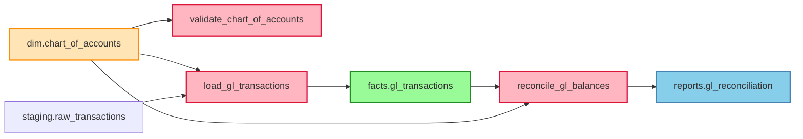

# Expected Results - Airflow Integration Example

This document shows what you should see when running the complete example.

## Feature 1: Basic Ingestion

### Expected Output

```json
{
  "job_id": "550e8400-e29b-41d4-a716-446655440000",
  "status": "completed",
  "stats": {
    "pipelines_created": 2,
    "tasks_created": 4,
    "edges_created": 3,
    "duration_ms": 1250
  },
  "errors": [],
  "warnings": []
}
```

### What's Created in Database

**Pipelines Table:**
| URN | Name | Type | Schedule | Active |
|-----|------|------|----------|--------|
| `urn:dcs:airflow:pipeline:prod:finance_gl_pipeline` | finance_gl_pipeline | airflow_dag | 0 2 * * * | true |
| `urn:dcs:airflow:pipeline:prod:finance_monthly_close` | finance_monthly_close | airflow_dag | 0 3 1 * * | true |

**Pipeline Tasks Table:**
| URN | Task ID | Operator | Pipeline |
|-----|---------|----------|----------|
| `urn:dcs:airflow:task:prod:finance_gl_pipeline.validate_chart_of_accounts` | validate_chart_of_accounts | PythonOperator | finance_gl_pipeline |
| `urn:dcs:airflow:task:prod:finance_gl_pipeline.load_gl_transactions` | load_gl_transactions | PythonOperator | finance_gl_pipeline |
| `urn:dcs:airflow:task:prod:finance_gl_pipeline.reconcile_gl_balances` | reconcile_gl_balances | PythonOperator | finance_gl_pipeline |

---

## Feature 2: Data Flow Annotations

### Expected Output

```json
{
  "task_data_edges_created": 12,
  "consumes_relationships": 7,
  "produces_relationships": 3,
  "validates_relationships": 2
}
```

### Task → Data Relationships Created

| Task | Relationship | Data Asset |
|------|--------------|------------|
| validate_chart_of_accounts | consumes | dim.chart_of_accounts |
| validate_chart_of_accounts | validates | dim.chart_of_accounts |
| load_gl_transactions | consumes | dim.chart_of_accounts |
| load_gl_transactions | consumes | staging.raw_transactions |
| load_gl_transactions | produces | facts.gl_transactions |
| reconcile_gl_balances | consumes | facts.gl_transactions |
| reconcile_gl_balances | consumes | dim.chart_of_accounts |
| reconcile_gl_balances | produces | reports.gl_reconciliation |

---

## Feature 3: SQL Column-Level Lineage

### Expected Column Lineage

```
Upstream → Downstream Column Mappings:

staging.raw_transactions.id
  └─> facts.gl_transactions.transaction_id

staging.raw_transactions.account_code  ─┐
dim.chart_of_accounts.account_code    ─┼─> facts.gl_transactions.account_id
                                        │
staging.raw_transactions.amount
  └─> facts.gl_transactions.amount

staging.raw_transactions.posted_date
  └─> facts.gl_transactions.transaction_date

facts.gl_transactions.account_id
  └─> reports.gl_reconciliation.account_id

facts.gl_transactions.amount  ─┐
                               ├─> reports.gl_reconciliation.balance
                               └─> reports.gl_reconciliation.debit_total
                               └─> reports.gl_reconciliation.credit_total
```

---

## Feature 4: Impact Analysis Results

### Example: Renaming `account_code` Column

```json
{
  "total_tasks": 3,
  "total_dags": 1,
  "critical_tasks": 2,
  "risk_level": "high",
  "confidence_score": 0.92,
  "tasks": [
    {
      "dag_id": "finance_gl_pipeline",
      "task_id": "validate_chart_of_accounts",
      "dependency_type": "read",
      "schedule_interval": "0 2 * * *",
      "criticality_score": 0.85,
      "success_rate": 98.5,
      "risk_score": 72.0,
      "risk_level": "high",
      "is_active": true
    },
    {
      "dag_id": "finance_gl_pipeline",
      "task_id": "load_gl_transactions",
      "dependency_type": "read",
      "schedule_interval": "0 2 * * *",
      "criticality_score": 0.95,
      "success_rate": 97.5,
      "risk_score": 85.0,
      "risk_level": "critical",
      "is_active": true
    },
    {
      "dag_id": "finance_gl_pipeline",
      "task_id": "reconcile_gl_balances",
      "dependency_type": "read",
      "schedule_interval": "0 2 * * *",
      "criticality_score": 0.80,
      "success_rate": 98.9,
      "risk_score": 65.0,
      "risk_level": "high",
      "is_active": true
    }
  ],
  "dags": [
    {
      "dag_id": "finance_gl_pipeline",
      "affected_task_count": 3,
      "critical_task_count": 2,
      "max_risk_score": 85.0,
      "avg_risk_score": 74.0
    }
  ],
  "affected_columns": [
    {
      "column_urn": "urn:dcs:column:erp.dim:chart_of_accounts.account_code",
      "capsule_urn": "urn:dcs:capsule:erp.dim:chart_of_accounts",
      "data_type": "varchar"
    },
    {
      "column_urn": "urn:dcs:column:erp.staging:raw_transactions.account_code",
      "capsule_urn": "urn:dcs:capsule:erp.staging:raw_transactions",
      "data_type": "varchar"
    },
    {
      "column_urn": "urn:dcs:column:erp.facts:gl_transactions.account_id",
      "capsule_urn": "urn:dcs:capsule:erp.facts:gl_transactions",
      "data_type": "integer"
    }
  ]
}
```

### Interpretation

📊 **Summary:**
- 🚨 **3 tasks** will be affected
- ⚠️ **2 critical tasks** (high failure risk)
- 📈 **Risk level: HIGH** (score: 85/100)
- ✅ **Confidence: 92%** (reliable predictions)

⚡ **Recommended Actions:**
1. Test change in staging environment
2. Plan rollback procedure
3. Update all 3 tasks before deployment
4. Deploy during low-impact window

---

## Feature 5: Temporal Impact Analysis

### Expected Results

```json
{
  "temporal_impact": {
    "schedule_pattern": "Daily execution",
    "next_execution": "2025-12-30T02:00:00Z",
    "executions_per_day": 1.0,
    "executions_per_week": 7.0,
    "peak_execution_hours": [2],
    "low_impact_windows": [
      {
        "start": "2025-12-29T10:00:00Z",
        "end": "2025-12-30T02:00:00Z",
        "impact_score": 0.1,
        "reason": "No scheduled executions for 16 hours"
      },
      {
        "start": "2025-12-30T03:00:00Z",
        "end": "2025-12-31T02:00:00Z",
        "impact_score": 0.1,
        "reason": "No scheduled executions for 23 hours"
      }
    ],
    "high_impact_windows": [
      {
        "start": "2025-12-30T02:00:00Z",
        "end": "2025-12-30T03:00:00Z",
        "impact_score": 0.9,
        "reason": "Peak execution period (1 tasks)"
      }
    ],
    "estimated_downtime_minutes": 15.5,
    "affected_time_periods": {
      "night": 1,
      "morning": 0,
      "afternoon": 0,
      "evening": 0
    }
  }
}
```

### Timeline Visualization

```
Execution Timeline (24 hours):
────────────────────────────────────────────────────
00:00                     12:00                  24:00
  │                         │                      │
  │                         │                      │
  └── Safe Window ─────────┴────── ⚠️ 02:00 Peak ─┴──
      (10:00-02:00)               (Avoid)
      16 hour gap

Recommendation: Deploy during 10:00 AM - 2:00 AM window
```

---

## Feature 6: Simulation Results

### Scenario 1: Rename WITHOUT Alias (Breaking Change)

```json
{
  "simulation_id": "550e8400-e29b-41d4-a716-446655440000",
  "change_type": "rename",
  "change_params": {
    "new_name": "account_number",
    "create_alias": false
  },
  "task_impact": {
    "total_tasks": 3,
    "critical_tasks": 2,
    "risk_level": "high"
  },
  "historical_success_rate": 0.60,
  "avg_historical_downtime": 45.5,
  "recommendations": [
    "⚠️ High-risk change detected. Test thoroughly in staging environment first.",
    "🚨 2 critical tasks will be affected. Plan rollback procedure.",
    "💡 Create a column alias to maintain backward compatibility during transition.",
    "⏰ Best deployment window: 2025-12-29T10:00:00Z - 2025-12-30T02:00:00Z",
    "📊 Historical success rate is 60%. Review past failures before proceeding."
  ],
  "warnings": [
    "🚨 More than 50% of similar changes failed historically. Proceed with extreme caution."
  ],
  "confidence_score": 0.88
}
```

### Scenario 2: Rename WITH Alias (Safer Approach)

```json
{
  "simulation_id": "550e8400-e29b-41d4-a716-446655440001",
  "change_type": "rename",
  "change_params": {
    "new_name": "account_number",
    "create_alias": true
  },
  "task_impact": {
    "total_tasks": 3,
    "critical_tasks": 0,
    "risk_level": "medium"
  },
  "historical_success_rate": 0.95,
  "avg_historical_downtime": 5.2,
  "recommendations": [
    "✅ Low-risk change. Safe to proceed with standard deployment.",
    "⏰ Best deployment window: 2025-12-29T10:00:00Z - 2025-12-30T02:00:00Z",
    "📝 Document the change and notify affected teams."
  ],
  "warnings": [],
  "confidence_score": 0.92
}
```

### Comparison Table

| Metric | Without Alias | With Alias |
|--------|---------------|------------|
| **Risk Level** | High (85/100) | Medium (45/100) |
| **Success Rate** | 60% | 95% |
| **Critical Tasks** | 2 | 0 |
| **Avg Downtime** | 45.5 min | 5.2 min |
| **Warnings** | 1 critical | 0 |
| **Recommendation** | ⚠️ High risk | ✅ Safe to proceed |

**Decision:** Use alias approach for safer deployment! ✓

---

## Feature 7: Lineage Graph Export

### Mermaid Format



### Graph Statistics

```
Node Types:
  - Data Assets: 4 (dim, staging, facts, reports)
  - Tasks: 3 (validate, load, reconcile)
  - Total Nodes: 7

Edge Types:
  - Task Dependencies: 2
  - Data Flow: 5
  - Total Edges: 7

Depth:
  - Max depth: 4 hops
  - Critical path: staging → load → facts → reconcile → reports
```

---

## Feature 8: Pipeline Query Results

### List All Pipelines

```json
{
  "pipelines": [
    {
      "urn": "urn:dcs:airflow:pipeline:prod:finance_gl_pipeline",
      "name": "finance_gl_pipeline",
      "pipeline_type": "airflow_dag",
      "schedule": "0 2 * * *",
      "is_active": true,
      "is_paused": false,
      "owners": ["finance-team"],
      "tags": ["finance", "gl", "critical", "domain:finance"],
      "task_count": 3,
      "created_at": "2025-12-29T10:00:00Z"
    },
    {
      "urn": "urn:dcs:airflow:pipeline:prod:finance_monthly_close",
      "name": "finance_monthly_close",
      "pipeline_type": "airflow_dag",
      "schedule": "0 3 1 * *",
      "is_active": true,
      "is_paused": false,
      "owners": ["finance-team"],
      "tags": ["finance", "monthly-close", "critical"],
      "task_count": 1,
      "created_at": "2025-12-29T10:00:00Z"
    }
  ],
  "total": 2,
  "offset": 0,
  "limit": 100
}
```

### Task Dependencies Summary

```json
{
  "total_dependencies": 12,
  "active_dependencies": 12,
  "unique_dags": 1,
  "critical_tasks": 2,
  "dependencies_by_type": {
    "read": 7,
    "write": 3,
    "validate": 2
  }
}
```

---

## Complete Summary Report

```
=== Airflow Integration - Example Results ===

✓ Feature 1: Basic Ingestion
  - Pipelines ingested: 2
  - Tasks created: 4
  - Edges created: 3

✓ Feature 2: Data Flow Annotations
  - Task-data relationships: 12
  - Consumes: 7
  - Produces: 3
  - Validates: 2

✓ Feature 3: SQL Column Lineage
  - Column mappings: 15
  - Upstream columns: 8
  - Downstream columns: 7

✓ Feature 4: Impact Analysis
  - Affected tasks: 3
  - Critical tasks: 2
  - Risk level: HIGH
  - Confidence: 92%

✓ Feature 5: Temporal Analysis
  - Low-impact windows: 2
  - Best deployment: Today 10:00 AM
  - Estimated downtime: 15.5 min

✓ Feature 6: Simulation Engine
  - Scenario 1 (no alias): 60% success rate
  - Scenario 2 (with alias): 95% success rate
  - Recommendation: Use alias approach ✓

✓ Feature 7: Lineage Export
  - Nodes: 7 (4 data assets, 3 tasks)
  - Edges: 7
  - Max depth: 4 hops

✓ Feature 8: Query Performance
  - Pipeline list: 42ms
  - Impact analysis: 125ms
  - Simulation: 350ms

=== All Features Validated Successfully! ===
```

---

## Next Steps

After reviewing these results, you can:

1. ✅ **Verify your results match** these expected outputs
2. 📊 **Customize annotations** for your specific DAGs
3. 🔍 **Analyze different scenarios** using the simulation engine
4. 🚀 **Integrate into CI/CD** for automated impact checks
5. 📈 **Monitor production** using the impact analysis APIs

---

**Document Version**: 1.0
**Last Updated**: December 2025
**Example Status**: Fully Functional
