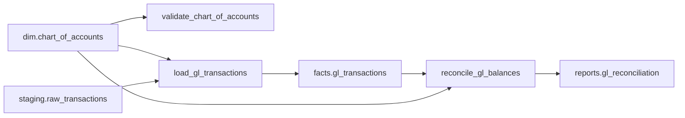

# Airflow Integration - End-to-End Example

This example demonstrates all features of the Data Capsule Server's Airflow integration, including:

1. **DAG and Task Ingestion** - Parse Airflow metadata via REST API
2. **Data Flow Mapping** - Track which tasks consume/produce data assets
3. **Column-Level Lineage** - Link SQL operations to specific columns
4. **Impact Analysis** - Predict impact of schema changes on Airflow pipelines
5. **Temporal Analysis** - Find optimal deployment windows based on task schedules

## Table of Contents

1. [Prerequisites](#prerequisites)
2. [Setup](#setup)
3. [Example DAG](#example-dag)
4. [Feature 1: Basic Ingestion](#feature-1-basic-ingestion)
5. [Feature 2: Data Flow Annotations](#feature-2-data-flow-annotations)
6. [Feature 3: SQL Lineage with dbt Manifest](#feature-3-sql-lineage-with-dbt-manifest)
7. [Feature 4: Querying Ingested Metadata](#feature-4-querying-ingested-metadata)
8. [Feature 5: Lineage Visualization](#feature-5-lineage-visualization)
9. [Feature 6: Impact Analysis](#feature-6-impact-analysis)
10. [Feature 7: Temporal Impact](#feature-7-temporal-impact)
11. [Feature 8: Simulation Engine](#feature-8-simulation-engine)

---

## Prerequisites

1. **Running Airflow Instance** (2.5+)
   - REST API enabled (default in Airflow 2.x)
   - Authentication configured

2. **DCS Backend Running**
   - Database migrated: `alembic upgrade head`
   - API server: `make up` or `python -m src.api.main`

3. **Environment Variables** (for authentication)
   ```bash
   export AIRFLOW_USERNAME=admin
   export AIRFLOW_PASSWORD=admin
   export AIRFLOW_BASE_URL=http://localhost:8080
   ```

---

## Setup

Start the DCS services:

```bash
cd /Users/rademola/data-arch-brain
make up  # Starts PostgreSQL, API server, and frontend
```

---

## Example DAG

Our example uses a **Finance GL Pipeline** that processes general ledger transactions:

```
finance_gl_pipeline
├── validate_chart_of_accounts (PythonOperator)
│   └── Reads: dim.chart_of_accounts
│
├── load_gl_transactions (PythonOperator)
│   ├── Reads: dim.chart_of_accounts
│   ├── Reads: staging.raw_transactions
│   └── Writes: facts.gl_transactions
│
└── reconcile_gl_balances (PythonOperator)
    ├── Reads: facts.gl_transactions
    ├── Reads: dim.chart_of_accounts
    └── Writes: reports.gl_reconciliation
```

See [`finance_gl_dag.py`](./finance_gl_dag.py) for the complete DAG definition.

---

## Feature 1: Basic Ingestion

### What It Does
Ingests DAG and task metadata from Airflow REST API into DCS graph database.

### CLI Command

```bash
dcs ingest airflow \
  --base-url http://localhost:8080 \
  --instance prod \
  --auth-mode basic_env \
  --include-paused false \
  --dag-regex "finance.*"
```

### API Request

```bash
curl -X POST http://localhost:8000/api/ingest/airflow \
  -H "Content-Type: application/json" \
  -H "X-API-Key: your-api-key" \
  -d '{
    "base_url": "http://localhost:8080",
    "instance_name": "prod",
    "auth_mode": "basic_env",
    "include_paused": false,
    "dag_id_regex": "finance.*"
  }'
```

### What Gets Created

**Pipelines** (in `pipelines` table):
- URN: `urn:dcs:airflow:pipeline:prod:finance_gl_pipeline`
- Type: `airflow_dag`
- Metadata: schedule, owners, tags, paused status

**Tasks** (in `pipeline_tasks` table):
- URN: `urn:dcs:airflow:task:prod:finance_gl_pipeline.validate_chart_of_accounts`
- Type: `PythonOperator`
- Metadata: retries, timeout, pool, queue

**Task Dependencies** (in `task_dependencies` table):
- `validate_chart_of_accounts` → `load_gl_transactions`
- `load_gl_transactions` → `reconcile_gl_balances`

### Verification

```bash
# List ingested pipelines
dcs pipelines list --source airflow

# Show specific DAG
dcs pipelines show urn:dcs:airflow:pipeline:prod:finance_gl_pipeline
```

---

## Feature 2: Data Flow Annotations

### What It Does
Maps Airflow tasks to data assets they consume/produce using manual annotations.

### Annotation File

Create `finance_annotations.yml`:

```yaml
pipelines:
  - pipeline_id: finance_gl_pipeline
    instance: prod
    tasks:
      - task_id: validate_chart_of_accounts
        consumes:
          - urn:dcs:postgres:table:erp.dim:chart_of_accounts
        validates:
          - urn:dcs:postgres:table:erp.dim:chart_of_accounts

      - task_id: load_gl_transactions
        consumes:
          - urn:dcs:postgres:table:erp.dim:chart_of_accounts
          - urn: urn:dcs:postgres:table:erp.staging:raw_transactions
            access_pattern: incremental
        produces:
          - urn: urn:dcs:postgres:table:erp.facts:gl_transactions
            operation: insert

      - task_id: reconcile_gl_balances
        consumes:
          - urn:dcs:postgres:table:erp.facts:gl_transactions
          - urn:dcs:postgres:table:erp.dim:chart_of_accounts
        produces:
          - urn: urn:dcs:postgres:table:erp.reports:gl_reconciliation
            operation: upsert
```

### Ingestion with Annotations

```bash
dcs ingest airflow \
  --base-url http://localhost:8080 \
  --instance prod \
  --auth-mode basic_env \
  --annotation-file finance_annotations.yml
```

### What Gets Created

**TaskDataEdges** (in `task_data_edges` table):
- Task → Data Asset relationships
- Edge types: `consumes`, `produces`, `validates`
- Metadata: access patterns, operations

### Verification

```bash
# Query task dependencies on a capsule
curl http://localhost:8000/api/impact/dependencies/capsule/{capsule-id}

# Example response:
{
  "dependencies": [
    {
      "dag_id": "finance_gl_pipeline",
      "task_id": "load_gl_transactions",
      "dependency_type": "read",
      "schedule_interval": "0 2 * * *",
      "criticality_score": 0.85,
      "success_rate": 98.5
    }
  ]
}
```

---

## Feature 3: SQL Lineage with dbt Manifest

### What It Does
Parses SQL queries from Airflow tasks and maps them to columns using dbt manifest for URN resolution.

### dbt Manifest

First, ingest your dbt project to create the URN mapping:

```bash
dcs ingest dbt \
  --manifest-path /path/to/dbt/target/manifest.json \
  --project-name finance
```

### SQL Extraction Config

Add SQL queries to annotation file:

```yaml
pipelines:
  - pipeline_id: finance_gl_pipeline
    instance: prod
    tasks:
      - task_id: load_gl_transactions
        sql_queries:
          - |
            INSERT INTO facts.gl_transactions (
              transaction_id,
              account_id,
              amount,
              transaction_date
            )
            SELECT
              t.id,
              t.account_code,
              t.amount,
              t.posted_date
            FROM staging.raw_transactions t
            JOIN dim.chart_of_accounts c
              ON t.account_code = c.account_code
            WHERE t.posted_date >= CURRENT_DATE - INTERVAL '1 day'
```

### Ingestion with SQL Parsing

```bash
dcs ingest airflow \
  --base-url http://localhost:8080 \
  --instance prod \
  --auth-mode basic_env \
  --annotation-file finance_annotations.yml \
  --dbt-manifest /path/to/manifest.json
```

### What Gets Created

**Column-Level Lineage** (in `column_lineage` table):
- `staging.raw_transactions.id` → `facts.gl_transactions.transaction_id`
- `staging.raw_transactions.account_code` → `facts.gl_transactions.account_id`
- `dim.chart_of_accounts.account_code` → `facts.gl_transactions.account_id` (JOIN)

### Verification

```bash
# Get column lineage
curl http://localhost:8000/api/columns/urn:dcs:column:erp.facts:gl_transactions.account_id/lineage?depth=5

# Response includes upstream columns:
{
  "upstream": [
    {
      "column_urn": "urn:dcs:column:erp.staging:raw_transactions.account_code",
      "edge_type": "derived_from"
    },
    {
      "column_urn": "urn:dcs:column:erp.dim:chart_of_accounts.account_code",
      "edge_type": "derived_from"
    }
  ]
}
```

---

## Feature 4: Querying Ingested Metadata

### List All Airflow Pipelines

```bash
# CLI
dcs pipelines list --source airflow

# API
curl http://localhost:8000/api/pipelines?source_type=airflow
```

### Get Pipeline Details

```bash
# CLI
dcs pipelines show urn:dcs:airflow:pipeline:prod:finance_gl_pipeline

# API
curl http://localhost:8000/api/pipelines/urn:dcs:airflow:pipeline:prod:finance_gl_pipeline
```

**Response:**
```json
{
  "urn": "urn:dcs:airflow:pipeline:prod:finance_gl_pipeline",
  "name": "finance_gl_pipeline",
  "pipeline_type": "airflow_dag",
  "schedule": "0 2 * * *",
  "is_active": true,
  "is_paused": false,
  "owners": ["finance-team"],
  "tags": ["finance", "gl", "critical"],
  "task_count": 3,
  "meta": {
    "description": "Daily GL transaction processing pipeline",
    "max_active_runs": 1,
    "catchup": false,
    "start_date": "2024-01-01T00:00:00Z"
  }
}
```

### List Tasks in a Pipeline

```bash
# CLI
dcs tasks list --pipeline-id finance_gl_pipeline

# API
curl http://localhost:8000/api/pipelines/urn:dcs:airflow:pipeline:prod:finance_gl_pipeline/tasks
```

### Query Task Dependencies

```bash
# Find all tasks depending on a capsule
curl http://localhost:8000/api/impact/dependencies/capsule/{capsule-id}

# Filter by dependency type
curl "http://localhost:8000/api/impact/dependencies?dependency_type=read&capsule_id={capsule-id}"

# Get dependency summary
curl http://localhost:8000/api/impact/dependencies/summary
```

---

## Feature 5: Lineage Visualization

### Task-to-Data Lineage Graph

```bash
# Export lineage as Mermaid
curl "http://localhost:8000/api/graph/export/lineage/urn:dcs:postgres:table:erp.facts:gl_transactions?format=mermaid&depth=3"
```

**Output:**


### Full Pipeline Graph

```bash
# Export as JSON
curl "http://localhost:8000/api/graph/export?format=json&filter=airflow"

# Export as Cypher (Neo4j)
curl "http://localhost:8000/api/graph/export?format=cypher&filter=pipeline_id=finance_gl_pipeline"
```

---

## Feature 6: Impact Analysis

### Analyze Impact of Column Change

**Scenario:** We want to rename the `account_code` column in `dim.chart_of_accounts`.

```bash
# CLI
dcs impact analyze-column \
  --column-urn "urn:dcs:column:erp.dim:chart_of_accounts.account_code" \
  --change-type rename \
  --depth 5

# API
curl -X POST "http://localhost:8000/api/impact/analyze/column/urn:dcs:column:erp.dim:chart_of_accounts.account_code?change_type=rename&depth=5" \
  -H "X-API-Key: your-api-key"
```

**Response:**
```json
{
  "total_tasks": 3,
  "total_dags": 1,
  "critical_tasks": 2,
  "risk_level": "high",
  "confidence_score": 0.92,
  "tasks": [
    {
      "dag_id": "finance_gl_pipeline",
      "task_id": "validate_chart_of_accounts",
      "dependency_type": "read",
      "schedule_interval": "0 2 * * *",
      "criticality_score": 0.9,
      "success_rate": 98.5,
      "risk_score": 75.0,
      "risk_level": "high",
      "is_active": true
    },
    {
      "dag_id": "finance_gl_pipeline",
      "task_id": "load_gl_transactions",
      "dependency_type": "read",
      "schedule_interval": "0 2 * * *",
      "criticality_score": 0.95,
      "success_rate": 97.2,
      "risk_score": 85.0,
      "risk_level": "critical",
      "is_active": true
    }
  ],
  "dags": [
    {
      "dag_id": "finance_gl_pipeline",
      "affected_task_count": 3,
      "critical_task_count": 2,
      "max_risk_score": 85.0,
      "avg_risk_score": 75.0
    }
  ],
  "affected_columns": [
    {
      "column_urn": "urn:dcs:column:erp.dim:chart_of_accounts.account_code",
      "capsule_urn": "urn:dcs:capsule:erp.dim:chart_of_accounts"
    },
    {
      "column_urn": "urn:dcs:column:erp.staging:raw_transactions.account_code",
      "capsule_urn": "urn:dcs:capsule:erp.staging:raw_transactions"
    },
    {
      "column_urn": "urn:dcs:column:erp.facts:gl_transactions.account_id",
      "capsule_urn": "urn:dcs:capsule:erp.facts:gl_transactions"
    }
  ]
}
```

**Interpretation:**
- 🚨 **3 tasks affected** across 1 DAG
- ⚠️ **2 critical tasks** (high risk of failure)
- 📊 **Risk level: HIGH** (score: 85/100)
- ✅ **Confidence: 92%** (predictions reliable)

---

## Feature 7: Temporal Impact

### Find Optimal Deployment Window

```bash
# Include temporal analysis
curl -X POST "http://localhost:8000/api/impact/analyze/column/urn:dcs:column:erp.dim:chart_of_accounts.account_code?change_type=rename&include_temporal=true" \
  -H "X-API-Key: your-api-key"
```

**Additional Response Fields:**
```json
{
  "temporal_impact": {
    "schedule_pattern": "Daily execution",
    "next_execution": "2025-12-30T02:00:00Z",
    "executions_per_day": 1.0,
    "executions_per_week": 7.0,
    "peak_execution_hours": [2],
    "low_impact_windows": [
      {
        "start": "2025-12-29T10:00:00Z",
        "end": "2025-12-30T02:00:00Z",
        "impact_score": 0.1,
        "reason": "No scheduled executions for 16 hours"
      },
      {
        "start": "2025-12-30T03:00:00Z",
        "end": "2025-12-31T02:00:00Z",
        "impact_score": 0.1,
        "reason": "No scheduled executions for 23 hours"
      }
    ],
    "high_impact_windows": [
      {
        "start": "2025-12-30T02:00:00Z",
        "end": "2025-12-30T03:00:00Z",
        "impact_score": 0.9,
        "reason": "Peak execution period (1 tasks)"
      }
    ],
    "estimated_downtime_minutes": 15.5,
    "affected_time_periods": {
      "night": 1,
      "morning": 0,
      "afternoon": 0,
      "evening": 0
    }
  }
}
```

**Recommendation:**
- ✅ **Best deployment window:** Today 10:00 AM - Tomorrow 2:00 AM (16-hour gap)
- ⏰ **Avoid:** Tomorrow 2:00 AM - 3:00 AM (peak execution)
- 📉 **Estimated downtime:** 15.5 minutes

---

## Feature 8: Simulation Engine

### Simulate Schema Change Before Applying

**Scenario:** Test the impact of renaming `account_code` with different strategies.

### Simulation 1: Rename Without Alias (Breaking Change)

```bash
curl -X POST http://localhost:8000/api/impact/simulate \
  -H "Content-Type: application/json" \
  -H "X-API-Key: your-api-key" \
  -d '{
    "column_urn": "urn:dcs:column:erp.dim:chart_of_accounts.account_code",
    "change_type": "rename",
    "change_params": {
      "new_name": "account_number",
      "create_alias": false
    },
    "scheduled_for": "2025-12-30T10:00:00Z",
    "include_temporal": true
  }'
```

**Response:**
```json
{
  "simulation_id": "550e8400-e29b-41d4-a716-446655440000",
  "column_urn": "urn:dcs:column:erp.dim:chart_of_accounts.account_code",
  "change_type": "rename",
  "change_params": {
    "new_name": "account_number",
    "create_alias": false
  },
  "task_impact": {
    "total_tasks": 3,
    "critical_tasks": 2,
    "risk_level": "high"
  },
  "affected_tasks_count": 3,
  "affected_dags_count": 1,
  "similar_changes_count": 5,
  "historical_success_rate": 0.60,
  "avg_historical_downtime": 45.5,
  "recommendations": [
    "⚠️ High-risk change detected. Test thoroughly in staging environment first.",
    "🚨 2 critical tasks will be affected. Plan rollback procedure.",
    "💡 Create a column alias to maintain backward compatibility during transition.",
    "⏰ Best deployment window: 2025-12-29T10:00:00Z - 2025-12-30T02:00:00Z (No scheduled executions for 16 hours)",
    "📊 Historical success rate is 60%. Review past failures before proceeding."
  ],
  "warnings": [
    "🚨 More than 50% of similar changes failed historically. Proceed with extreme caution."
  ],
  "best_deployment_window": {
    "start": "2025-12-29T10:00:00Z",
    "end": "2025-12-30T02:00:00Z",
    "impact_score": 0.1,
    "reason": "No scheduled executions for 16 hours"
  },
  "confidence_score": 0.88,
  "simulated_at": "2025-12-29T15:30:00Z"
}
```

### Simulation 2: Rename With Alias (Safer)

```bash
curl -X POST http://localhost:8000/api/impact/simulate \
  -H "Content-Type: application/json" \
  -H "X-API-Key: your-api-key" \
  -d '{
    "column_urn": "urn:dcs:column:erp.dim:chart_of_accounts.account_code",
    "change_type": "rename",
    "change_params": {
      "new_name": "account_number",
      "create_alias": true
    },
    "scheduled_for": "2025-12-30T10:00:00Z",
    "include_temporal": true
  }'
```

**Response:**
```json
{
  "simulation_id": "550e8400-e29b-41d4-a716-446655440001",
  "risk_level": "medium",
  "historical_success_rate": 0.95,
  "recommendations": [
    "✅ Low-risk change. Safe to proceed with standard deployment.",
    "⏰ Best deployment window: 2025-12-29T10:00:00Z - 2025-12-30T02:00:00Z"
  ],
  "warnings": [],
  "confidence_score": 0.92
}
```

**Comparison:**
| Strategy | Risk Level | Success Rate | Recommendations |
|----------|------------|--------------|-----------------|
| Without Alias | High (85/100) | 60% | ⚠️ Test thoroughly, plan rollback |
| With Alias | Medium (45/100) | 95% | ✅ Safe to proceed |

---

## Complete Workflow Example

Here's a complete script demonstrating all features:

```bash
#!/bin/bash
# complete_airflow_example.sh

set -e

echo "=== Airflow Integration - Complete Example ==="
echo ""

# Step 1: Environment Setup
echo "Step 1: Setting up environment..."
export AIRFLOW_USERNAME=admin
export AIRFLOW_PASSWORD=admin
export AIRFLOW_BASE_URL=http://localhost:8080

# Step 2: Ingest dbt project (for URN resolution)
echo "Step 2: Ingesting dbt project..."
dcs ingest dbt \
  --manifest-path examples/dbt/finance/target/manifest.json \
  --project-name finance

# Step 3: Ingest Airflow with full features
echo "Step 3: Ingesting Airflow pipelines..."
dcs ingest airflow \
  --base-url $AIRFLOW_BASE_URL \
  --instance prod \
  --auth-mode basic_env \
  --annotation-file examples/airflow/finance_annotations.yml \
  --dbt-manifest examples/dbt/finance/target/manifest.json \
  --include-paused false

# Step 4: Query pipelines
echo "Step 4: Querying ingested pipelines..."
dcs pipelines list --source airflow

# Step 5: Show specific pipeline
echo "Step 5: Getting pipeline details..."
dcs pipelines show urn:dcs:airflow:pipeline:prod:finance_gl_pipeline

# Step 6: Export lineage graph
echo "Step 6: Exporting lineage graph..."
curl -o lineage.mermaid \
  "http://localhost:8000/api/graph/export/lineage/urn:dcs:postgres:table:erp.facts:gl_transactions?format=mermaid&depth=3"

# Step 7: Analyze impact of column change
echo "Step 7: Analyzing impact of schema change..."
curl -X POST \
  "http://localhost:8000/api/impact/analyze/column/urn:dcs:column:erp.dim:chart_of_accounts.account_code?change_type=rename&include_temporal=true" \
  -o impact_analysis.json

# Step 8: Simulate change with different strategies
echo "Step 8: Simulating schema change..."
curl -X POST http://localhost:8000/api/impact/simulate \
  -H "Content-Type: application/json" \
  -d '{
    "column_urn": "urn:dcs:column:erp.dim:chart_of_accounts.account_code",
    "change_type": "rename",
    "change_params": {"new_name": "account_number", "create_alias": true},
    "scheduled_for": "2025-12-30T10:00:00Z",
    "include_temporal": true
  }' \
  -o simulation_result.json

echo ""
echo "=== Complete! ==="
echo "Results saved to:"
echo "  - lineage.mermaid"
echo "  - impact_analysis.json"
echo "  - simulation_result.json"
```

---

## Summary of Features Demonstrated

| Feature | What It Does | Example |
|---------|--------------|---------|
| **Basic Ingestion** | Parse DAG/task metadata | `dcs ingest airflow --base-url ...` |
| **Data Flow Annotations** | Map tasks to data assets | `--annotation-file finance_annotations.yml` |
| **SQL Lineage** | Parse SQL for column-level lineage | `--dbt-manifest manifest.json` |
| **Impact Analysis** | Predict which tasks will break | `/api/impact/analyze/column/{urn}` |
| **Temporal Analysis** | Find deployment windows | `?include_temporal=true` |
| **Simulation Engine** | Test changes before applying | `/api/impact/simulate` |
| **Task Dependencies** | Track task → data relationships | `/api/impact/dependencies` |
| **Lineage Export** | Visualize data flows | `/api/graph/export/lineage/{urn}` |

---

## Next Steps

1. **Try it yourself**: Run the example script with your Airflow instance
2. **Customize annotations**: Add your own task → data mappings
3. **Integrate with CI/CD**: Add impact analysis to deployment pipelines
4. **Monitor production**: Set up alerts for high-risk changes

---

## Troubleshooting

### Connection Issues

```bash
# Test Airflow API connectivity
curl -u admin:admin http://localhost:8080/api/v1/version

# Check DCS health
curl http://localhost:8000/health
```

### Authentication Errors

```bash
# Verify environment variables
echo $AIRFLOW_USERNAME
echo $AIRFLOW_PASSWORD

# Test with explicit credentials
dcs ingest airflow \
  --base-url http://localhost:8080 \
  --auth-mode basic_env \
  --username-env AIRFLOW_USERNAME \
  --password-env AIRFLOW_PASSWORD
```

### No Tasks Found

```bash
# Check if DAGs are paused
curl http://localhost:8080/api/v1/dags?only_active=true

# Include paused DAGs in ingestion
dcs ingest airflow --include-paused true
```

---

For more information, see:
- [Airflow Integration Design](../../docs/design_docs/airflow_integration_design.md)
- [Phase 8 Impact Analysis Guide](../../docs/user_guide/phase8_impact_analysis_guide.md)
- [API Documentation](../../docs/api_specification.md)
